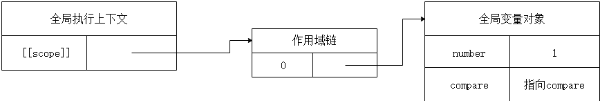
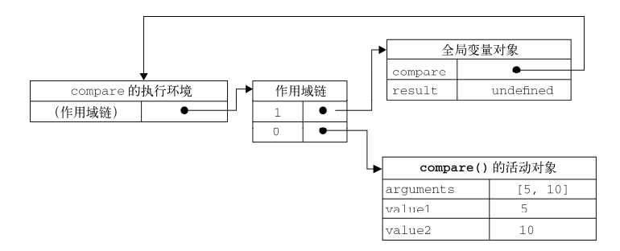

### 作用域

##### 1.什么是作用域

在 JavaScript 中，我们可以将作用域定义为一套规则，这套规则用来管理 JS 引擎如何在当前作用域以及嵌套的子作用域中根据标识符名称进行变量查找。这里的标识符，指的是变量名或者函数名。简单的说，**作用域就是变量与函数的可访问范围**

JavaScript 中有全局作用域与函数作用域(因为 eval 我们平时开发中几乎不会用到它，这里不讨论)。ES6 的到来，为我们提供了‘块级作用域’,可通过新增命令 let 和 const 来体现。

```javascript
function outFun2() {
  var inVariable = "内层变量2";
}
outFun2();
console.log(inVariable); // Uncaught ReferenceError: inVariable is not defined
```

上述代码中，变量 inVariable 在全局作用域没有声明，所以在全局作用域下取值会报错。我们可以这样理解：作用域就是一个独立的区域，让变量不会外泄、暴露出去。也就是说作用域最大的用处就是隔离变量，不同作用域下同名变量不会有冲突。

##### 2. 全局作用域

在代码中任何地方都能访问到的对象拥有全局作用域，一般来说以下几种情形拥有全局作用域：

1. 最外层函数 和在最外层函数外面定义的变量拥有全局作用域

```javascript
var outVariable = "我是最外层变量"; //最外层变量
function outFun() {
  //最外层函数
  var inVariable = "内层变量";
  function innerFun() {
    //内层函数
    console.log(inVariable);
  }
  innerFun();
}
console.log(outVariable); //我是最外层变量
outFun(); //内层变量
console.log(inVariable); //inVariable is not defined
innerFun(); //innerFun is not defined
```

2. 所有末定义直接赋值的变量自动声明为拥有全局作用域

```javascript
function outFun2() {
  variable = "未定义直接赋值的变量";
  var inVariable2 = "内层变量2";
}
outFun2(); //要先执行这个函数，否则根本不知道里面是啥
console.log(variable); //未定义直接赋值的变量
console.log(inVariable2); //inVariable2 is not defined
```

3. 所有 window 对象的属性拥有全局作用域
 一般情况下，window 对象的内置属性都拥有全局作用域，例如 window.name、window.location、window.top 等等。

全局作用域有个弊端：如果我们写了很多行 JS 代码，变量定义都没有用函数包括，那么它们就全部都在全局作用域中。这样就会 污染全局命名空间, 容易引起命名冲突。
这就是为何很多库的源码，所有的代码都会放在(function(){....})()中。因为放在里面的所有变量，都不会被外泄和暴露，不会污染到外面，不会对其他的库或者 JS 脚本造成影响。这是函数作用域的一个体现。

##### 3. 函数作用域

函数作用域,是指声明在函数内部的变量，和全局作用域相反，局部作用域一般只在固定的代码片段内可访问到，最常见的例如函数内部。

```javascript
function doSomething() {
  var blogName = "浪里行舟";
  function innerSay() {
    alert(blogName);
  }
  innerSay();
}
alert(blogName); //脚本错误
innerSay(); //脚本错误
```

作用域是分层的，内层作用域可以访问外层作用域的变量，反之则不行。

##### 4. 块级作用域

块级作用域可通过新增命令 let 和 const 声明，所声明的变量在指定块的作用域外无法被访问。块级作用域在如下情况被创建：

在一个函数内部
在一个代码块（由一对花括号包裹）内部
let 声明的语法与 var 的语法一致。你基本上可以用 let 来代替 var 进行变量声明，但会将变量的作用域限制在当前代码块中。块级作用域有以下几个特点：

1. 声明变量不会提升到代码块顶部
   let/const 声明并不会被提升到当前代码块的顶部，因此你需要手动将 let/const 声明放置到顶部，以便让变量在整个代码块内部可用。

```javascript
function getValue(condition) {
  if (condition) {
    let value = "blue";
    return value;
  } else {
    // value 在此处不可用
    return null;
  }
  // value 在此处不可用
}
```

2. 禁止重复声明
如果一个标识符已经在代码块内部被定义，那么在此代码块内使用同一个标识符进行 let 声明就会导致抛出错误。例如：
var count = 30;
let count = 40; // Uncaught SyntaxError: Identifier 'count' has already been declared

##### 5. 作用域与执行上下文

许多开发人员经常混淆作用域和执行上下文的概念，误认为它们是相同的概念，但事实并非如此。

我们知道 JavaScript 属于解释型语言，JavaScript 的执行分为：解释和执行两个阶段,这两个阶段所做的事并不一样：

1. 解释阶段：

- 词法分析
- 语法分析
- 作用域规则确定

2. 执行阶段：

- 创建执行上下文
- 执行函数代码
- 垃圾回收

JavaScript 解释阶段便会确定作用域规则，因此作用域在函数定义时就已经确定了，而不是在函数调用时确定，但是执行上下文是函数执行之前创建的。执行上下文最明显的就是 this 的指向是执行时确定的。而作用域访问的变量是编写代码的结构确定的。

作用域和执行上下文之间最大的区别是： **执行上下文在运行时确定**，随时可能改变；**作用域在定义时就确定，并且不会改变**。

一个作用域下可能包含若干个上下文环境。有可能从来没有过上下文环境（函数从来就没有被调用过）；有可能有过，现在函数被调用完毕后，上下文环境被销毁了；有可能同时存在一个或多个（闭包）。同一个作用域下，不同的调用会产生不同的执行上下文环境，继而产生不同的变量的值。

### 作用域链

##### 1.什么是作用域链

首先我们要明确的一点是，作用域和作用域链是不同的。
作用域是一套规则。
而作用域链，则是作用域的具体实现。
作用域链本质上是一个指向变量对象的指针列表，它只引用但不实际包含变量对象。作用域链的前端始终都是当前执行上下文的变量对象，如果这个执行上下文属于函数执行上下文，则用活动对象作为变量对象,作用域链的末端始终是全局执行上下文的变量对象（也就是全局对象）。

```javascript
var a = 20;
function test() {
  var b = a + 10;
  function innerTest() {
    var c = 10;
    return b + c;
  }
  return innerTest();
}
test();
```

在上面的例子中，全局，函数 test，函数 innerTest 的执行上下文先后创建。我们设定他们的变量对象分别为 VO(global)，VO(test), VO(innerTest)。而 innerTest 的作用域链，则同时包含了这三个变量对象，所以 innerTest 的执行上下文可如下表示。

```javascript
innerTestEC = {
  VO: {...},  // 变量对象
  scopeChain: [VO(innerTest), VO(test), VO(global)], // 作用域链
}
```

我们这里使用一个数组来模拟作用域链，数组的第一项 scopeChain[0]为作用域链的最前端，而数组的最后一项，为作用域链的最末端，所有的最末端都为全局变量对象。

##### 2.作用域链的创建过程

一般我们都认为作用域链是在函数定义时就已经创建好的，所以它只和定义时的函数包含关系有关。但其实是一个动态的创建过程，下面我们通过一个例子来看一下作用域链的创建过程：

```javascript
var number = 1;

compare(5, 10);

function compare(value1, value2) {
  inner();

  if (value1 < value2) {
    return -1;
  } else if (value1 > value2) {
    return 1;
  } else {
    return 0;
  }

  function inner() {
    var a = 1;
  }
}
```

###### 2.1 全局阶段

我们从程序开始时讲起。首先在执行全局代码前，我们会先创建全局上下文。创建全局上下文的第一步是创建全局变量对象，然后将全局变量对象放入作用域链的顶端(执行上下文中的 [[Scope]]属性指向作用域链)。如下图所示（图中省略了其他属性）

此时全局上下文中的[[Scope]]属性可以这样表示

globalContext.[[Scope]] = [
globalContext.VO
];

注意在创建完作用域链后，JavaScript 引擎还做了另一件事，这也是实现作用域链的最关键的一步，它会为变量对象中的所有函数添加一个[[Scope]]属性，而这个属性的值就是我们刚才介绍的全局上下文中的[[Scope]]属性值。如下，

compare.[[Scope]] = [
globalContext.VO
];

###### 2.2 函数阶段

全局上下文创建后，开始执行代码，根据代码动态的修改变量对象中的属性，当我们执行到 compare(5,10)时，让我们来看一看在函数阶段是如何创建作用域链的。

首先在执行 compare(5,10)之前，我们会为函数创建对应的执行上下文。注意重点来了函数上下文首先会复制函数的[[Scope]]属性用来创建作用域链，然后用 arguments 创建活动对象，最后再将活动对象压入作用域链顶端，如下所示，



comapre 执行上下文复制[[Scope]]属性创建作用域链后可以这样表示

```javascript
compareContext = {
  Scope: compare[[Scope]],
};
```

压入活动对象后作用域链如下

```javascript
checkScopeContext = {
    AO: {
       ...
    },
    Scope: [AO, [[Scope]]]
}
```

在创建好作用域链后，JavaScript 引擎同样会判断函数执行上下文的活动对象中的函数声明，然后为变量对象中的所有函数添加一个[[Scope]]属性，而这个属性的值就是当前函数上下文中的[[Scope]]属性值。如所示

```javascript
inner[[Scope]] = [checkScopeContext.AO, globalContext.VO];
```

在代码执行阶段会对函数上下文中属性动态修改，因为作用域链是对变量对象的引用，因此我们可以实时地获取变量对象的最新状态，保证对作用域链查询时能够保证变量的准确性。

接下来对于 inner 函数，在执行到它时会继续这些上面同样的操作来创建作用域链，这就是我为什么说作用域链的创建是一个动态的过程的原因。

###### 2.3 总结

1. 全局上下文阶段，创建全局对象。

2. 将全局对象压入作用域链

3. 为全局对象中所有函数创建[[Scope]]属性，并将作用域链保存到该属性。（若无函数则跳过此步骤）

4. 每一个函数上下文阶段，复制函数的[[Scope]]属性，创建作用域链

5. 创建活动对象，并用 arguments 创建活动对象

6. 将活动对象压入当前上下文中的作用域链

7. 为活动对象中所有函数创建[[Scope]]属性，并将作用域链保存到该属性。（若无函数则跳过此步骤）

##### 3. 扩展作用域链

虽然执行上下文的类型总共只有两种———全局和局部（函数），但还是有办法延长作用域链的。这么说是因为有些语句可以在作用域链的前端临时增加一个变量对象，该变量对象会在代码执行后被移除。有两种情况会发生这种现象，如下：

1. try-catch 语句中的 catch 块
2. 当 with 语句执行时，会将 with () 中指定的对象压入当前上下文作用域链中。

### 闭包

函数执行后返回结果是一个内部函数，并被外部变量所引用，如果内部函数持有被执行函数作用域的变量，即形成了闭包。

可以在内部函数访问到外部函数作用域。使用闭包，一可以读取函数中的变量，二可以将函数中的变量存储在内存中，保护变量不被污染。而正因闭包会把函数中的变量值存储在内存中，会对内存有消耗，所以不能滥用闭包，否则会影响网页性能，造成内存泄漏。当不需要使用闭包时，要及时释放内存，可将内层函数对象的变量赋值为 nul

###### 闭包原理

利用了函数作用域链的特性，一个函数内部定义的函数会将包含外部函数的活动对象添加到它的作用域链中，函数执行完毕，其执行作用域链销毁，但因内部函数的作用域链仍然在引用这个活动对象，所以其活动对象不会被销毁，直到内部函数被烧毁后才被销毁。

参考链接:
[JavaScript 深入理解之作用域链](http://cavszhouyou.top/JavaScript%E6%B7%B1%E5%85%A5%E7%90%86%E8%A7%A3%E4%B9%8B%E4%BD%9C%E7%94%A8%E5%9F%9F%E9%93%BE.html)
