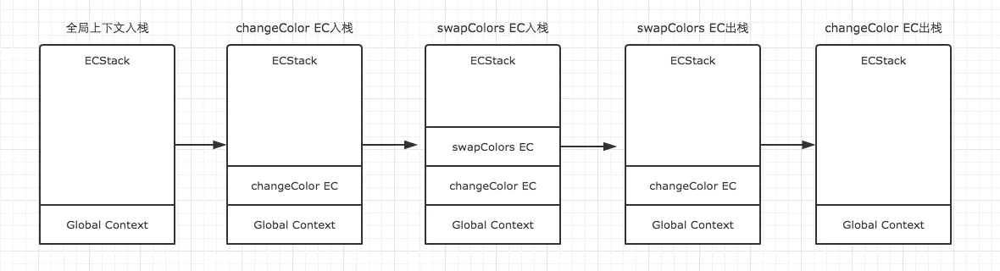

### 1. javascript 代码解析
  ```javascript
  test(); // 'test'
  function test(){
      console.log("test");
  }
  ```
  在上述代码中test 函数的声明被提升了，使得 test 函数在整个代码执行期间都可以访问到。那声明是什么时候提升的呢？就是在 JavaScript 引擎对代码解析的时候。JavaScript 引擎在执行一段可执行代码之前，会先进行准备工作，也就是对这段代码进行解析（也可以称为预处理）。这个阶段会根据可执行代码创建相应的执行上下文（ Execution Context ），也就是做声明提升等工作（后边会详细讲解）。然后在代码解析完成后才开始代码的执行。
  
 注意： JavaScript 引擎解析执行代码的过程是一个边执行边解析的过程，解析发生在执行一段可执行代码之前。举个例子，当执行到一个函数的时候，就会先对这个函数进行解析，然后再执行这个函数。

### 1. javascript执行环境
执行上下文可以理解为函数执行的环境，每一个函数执行时，都会给对应的函数创建这样一个执行环境。每次当控制器转到可执行代码的时候，就会进入一个执行上下文。执行上下文可以理解为当前代码的执行环境，它会形成一个作用域。JavaScript中的运行环境大概包括三种情况。
1. 全局环境：在执行所有代码前，解析创建全局执行上下文。
2. 函数环境：执行函数前，解析创建函数执行上下文。
3. eval（不建议使用，可忽略）运行于当前执行上下文中

### 3. 执行上下文的组成
执行上下文定义了变量或函数有权访问的其他数据，决定了它们各自的行为。每一个执行上下文都由以下三个属性组成。
  1. 变量对象（Variable object，VO）
  2. 作用域链(Scope chain)
  3. this

### 4. 执行上下文栈
由上可知，在一个JavaScript程序中，必定会产生多个执行上下文，JavaScript 引擎创建了执行上下文栈（Execution context stack，ECS）来管理执行上下文。栈底永远都是全局上下文，而栈顶就是当前正在执行的上下文。当代码在执行过程中，遇到前面三种情况，都会生成一个执行上下文，放入栈中，而处于栈顶的上下文执行完毕之后，就会自动出栈。

JavaScript 开始要解释执行代码的时候，最先遇到的就是全局代码，所以 JavaScript 引擎会先解析创建全局执行上下文，然后将全局执行上下文压栈。然后当执行流进入一个函数时，会先解析创建函数的执行上下文，然后将它的执行上下文压栈。而在函数执行之后，会将其执行上下文弹栈，弹栈后执行上下文中所有的数据都会被销毁，然后把控制权返回给之前的执行上下文。
为深入理解这个过程，请看以下这个例子
```javascript
var color = 'blue';

function changeColor() {
  var anotherColor = 'red';

  function swapColors() {
    var tempColor = anotherColor;
    anotherColor = color;
    color = tempColor;
  }

  swapColors();
}

changeColor();
```

 1. 第一步：全局上下文入栈
全局上下文入栈之后，其中的可执行代码开始执行，直到遇到了changeColor()，这一句激活函数changeColor创建它自己的执行上下文，因此第二步就是changeColor的执行上下文入栈。

2. 第二步：changeColor的执行上下文入栈
changeColor的上下文入栈之后，控制器开始执行其中的可执行代码，遇到swapColors()之后又激活了一个执行上下文。因此第三步是swapColors的执行上下文入栈。

3. 第三步：swapColors的执行上下文入栈
在swapColors的可执行代码中，再没有遇到其他能生成执行上下文的情况，因此这段代码顺利执行完毕，swapColors的上下文从栈中弹出。

4. 第四步：swapColors的执行上下文出栈
swapColors的执行上下文弹出之后，继续执行changeColor的可执行代码，也没有再遇到其他执行上下文，顺利执行完毕之后弹出。这样，ECStack中就只剩下全局上下文了。

 5. 第五步：changeColor的执行上下文出栈
全局上下文在浏览器窗口关闭后出栈。

注意：函数中，遇到return能直接终止可执行代码的执行，因此会直接将当前上下文弹出栈。

整个过程

### 总结
详细了解了这个过程之后，我们就可以对执行上下文进行总结了。
1. 单线程
2. 同步执行，只有栈顶的上下文处于执行中，其他上下文需要等待
3. 全局上下文只有唯一的一个，它在浏览器关闭时出栈
4. 函数的执行上下文的个数没有限制
5. 每次某个函数被调用，就会有个新的执行上下文为其创建，即使是调用的自身函数，也是如此。


