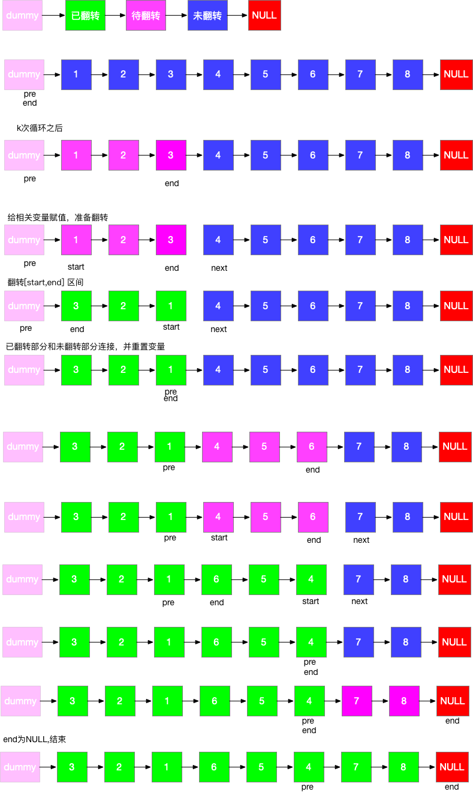

1. 题目描述
  给你一个链表，每 k 个节点一组进行翻转，请你返回翻转后的链表。
  k 是一个正整数，它的值小于或等于链表的长度。
  如果节点总数不是 k 的整数倍，那么请将最后剩余的节点保持原有顺序。

  示例：
  给你这个链表：1->2->3->4->5
  当 k = 2 时，应当返回: 2->1->4->3->5
  当 k = 3 时，应当返回: 3->2->1->4->5

  说明：
  你的算法只能使用常数的额外空间。
  你不能只是单纯的改变节点内部的值，而是需要实际进行节点交换。

2. 思路
<!-- https://leetcode-cn.com/problems/reverse-nodes-in-k-group/solution/tu-jie-kge-yi-zu-fan-zhuan-lian-biao-by-user7208t/ -->

1. 链表分区为已翻转部分+待翻转部分+未翻转部分
2. 每次翻转前，要确定翻转链表的范围，这个必须通过 k 此循环来确定
3. 需记录翻转链表前驱和后继，方便翻转完成后把已翻转部分和未翻转部分连接起来
4. 初始需要两个变量 pre 和 end，pre 代表待翻转链表的前驱，end 代表待翻转链表的末尾
5. 经过k此循环，end 到达末尾，记录待翻转链表的后继 next = end.next
6. 翻转链表，然后将三部分链表连接起来，然后重置 pre 和 end 指针，然后进入下一次循环
7. 特殊情况，当翻转部分长度不足 k 时，在定位 end 完成后，end==null，已经到达末尾，说明题目已完成，直接返回即可
8. 时间复杂度为 O(n*K)最好的情况为 O(n) 最差的情况未 O(n^2)
9. 空间复杂度为 O(1) 除了几个必须的节点指针外，我们并没有占用其他空间
```javascript
/**
 * Definition for singly-linked list.
 * function ListNode(val, next) {
 *     this.val = (val===undefined ? 0 : val)
 *     this.next = (next===undefined ? null : next)
 * }
 */
/**
 * @param {ListNode} head
 * @param {number} k
 * @return {ListNode}
 */
var reverseKGroup = function(head, k) {
    let dummy = new ListNode()
    dummy.next = head;
    let prev = dummy, end=dummy;
    while(!end.next){
      //循环k次，找到需要翻转的链表的结尾,这里每次循环要判断end是否等于空,因为如果为空，end.next会报空指针异常。
      //dummy->1->2->3->4->5 若k为2，循环2次，end指向2
      for(let i = 0; i < k && end; i++)  end = end.next; 
      ////如果end==null，即需要翻转的链表的节点数小于k，不执行翻转
      if(!end) break;
      //记录下要翻转链表的头节点
      let start = prev.next;
      //先记录下end.next,方便后面链接链表
      let next = end.next;
      //然后断开链表
      end.next = null;
       //翻转链表,pre.next指向翻转后的链表。1->2 变成2->1。 dummy->2->1
      prev.next = reverse(start)
      //翻转后头节点变到最后。通过.next把断开的链表重新链接。
      start.next=next;
      //将pre换成下次要翻转的链表的头结点的上一个节点。即start
      pre=start;
      //翻转结束，将end置为下次要翻转的链表的头结点的上一个节点。即start
      end=start;
    }
    return dummy.next;

    function reverse(head) {
      let prev = null, current = head;
      while(current) {
        let next = current.next;
        current.next = prev;
        prev = current;
        current = next;
      }
      return prev
    }
};
```
