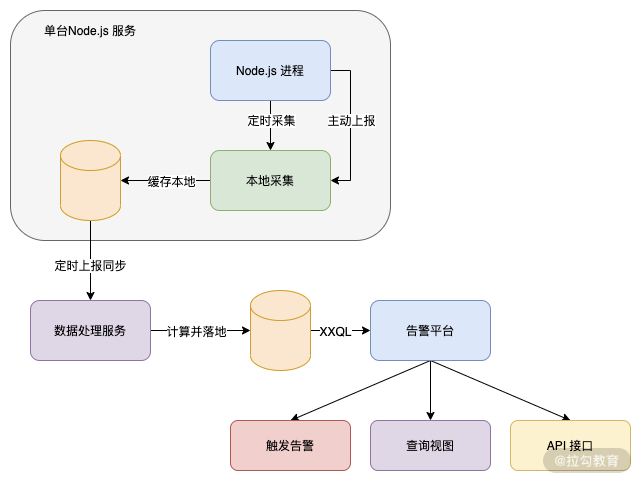

### 哪些场景会导致 Node.js 异常？

1. 由于 Node.js 使用的是 JavaScript，而 JavaScript 是一个弱类型语言，因此经常会引发一些由代码逻辑的异常导致的进程异常退出。

2. 其次在 Node.js 中也经常会因为内存的使用不当，导致内存泄漏，当在 64 位系统中达到 1.4 G（32 位系统 0.7 G）时，Node.js 就会异常崩溃。

3. 再而由于 Node.js 的 I/O 较多也较为频繁，当启用较多 I/O 句柄，但是没有及时释放，同样会引发进程问题。

这些都会导致服务器异常退出，就没办法正常提供服务了，从而引发现网问题。

### 监控告警介绍

上图是一个最简单的层级结构图，具体每个层级设计其实是非常复杂的。

我们可以看到在 Node.js 服务器中，会包含两部分：

1. 自动**定时采集**进程的指标数据；

2. 接口被调用或者访问后**主动上报**的信息。

以上的两部分信息都会异步地发送给本地一个采集服务，落地到本地临时缓存中，然后定时地将本地临时缓存的上报信息发送给监控数据处理服务。

监控数据处理经过一系列的复杂计算，按照一定的数据要求落入监控平台的数据存储中，告警平台则使用特定 QL 语法查询数据库，主要服务于三种类型：

触发告警，根据告警平台的设置，当数据落入后判断是否满足告警机制，满足则调用告警模块触发告警；

查询视图，这部分就是一个前端可交互的界面，用户可以在这个平台查询监控信息；

API 接口，有些情况需要针对告警进行一些研发操作，因此也支持 API 来查询监控告警信息。

### 平台介绍

在系统监控告警方面，Node.js 的 PM2 提供了付费服务，你可以直接用 PM2 来构建一个专门的监控告警机制，其中覆盖的进程管理功能也是比较齐全的。

不过还有另外一个方式就是自己构建一套开源免费的 prometheus 服务，如果是公司级别应用的话，可以参考 prometheus 官网自己搭建一套这种服务，其对 Node.js 的支持也是非常到位的，扩展请参考 GitHub prom-client 库。

而在业务告警方面你可以直接复用当前后台侧的业务告警系统，或者 prometheus 也是可以的，又或者目前常用的一套组合系统 Grafana（主要是监控系统界面操作平台）+InfluxDB（数据存储）+telegraf（数据采集） 也可以。

### 监控指标

在进程监控告警层面，我们要了解到底应该监控 Node.js 的哪些指标属性，其次在业务层面我们又应该主动上报哪些信息来作为监控指标。

#### Node.js 进程方面

我们要监控以下几个指标。

1. 事件延迟

因为 Node.js 主要是事件循环，如果主线程被长时间占用，就会导致事件执行有延迟，而最简单的办法就是**使用 setTimeout 来判断**。当我们设定 1000ms 执行某个事件，但是真正开始执行的时间大于 1000ms，那么我们就可能存在事件延迟了，而如果这个延迟越来越长，那么就必须进行告警提示开发者需要查看是否有异常事件被卡住，或者服务压力过大。

2. CPU 使用率

这是一个非常重要的指标，当发现 CPU 使用率长期维持在 70% 以上，我们就要**考虑是否需要扩容，或者是增加进程的方式来解决这个问题**，如果长期在 100% 那么肯定是需要扩容，或者检查内部代码逻辑是否存在问题。

3. 内存变化

Node.js 的内存泄漏还是比较常见的，其**最大的问题就是导致垃圾回收时间变长，从而影响 Node.js 的服务性能，最大的影响就是内存达到上限后进行重启，从而中断用户请求，引发在重启过程中的用户请求。**

4. 句柄变化

由于服务器的句柄是有上限的，如果无节制地开启句柄，将会导致系统性能损耗，从而影响进程的性能，因此我们必须在未使用句柄时进行释放，而如果长期不释放就会在达到上限时，导致新的请求无法开启新的句柄，从而无法正常提供服务。

5. 进程异常重启次数

也是用来判断我们代码逻辑是否足够健壮的一个点，如果存在异常重启次数，那么一定是我们代码中存在未 catch 住的异常，或者说上面提到的内存泄漏上限问题。

以上指标在达到一定限度的时候，就应该进行告警提示开发者。

#### 在业务层面

我们主要是关心服务提供的**业务响应速度**，我们需要把所有的接口按照以下指标进行上报（这点和其他后台服务差异不大）。

1. 接口名称
   主要是用来区分接口的唯一性。

2. 接口请求时服务器时间
   用来保留用户请求的时间节点。

3. 接口的请求用户分类标识
   有些需要根据设备、地区、网络运营商、版本信息等进行不同纬度的数据统计，因此这部分需要根据自身业务进行上报。

4. 接口请求耗时
   尽量细分，比如 Node.js 内部逻辑耗时、第三方接口耗时以及一些存储服务的请求耗时，例如 Redis、MySQL、MongoDB 等。

5. 当前服务器 IP
   有些可能和服务器有关，比如如果负载均衡未做好，导致部分机器分发的请求过大，从而引发部分机器过载的问题，因此上报当前服务器的 IP 也是非常关键的点。

拿到上面这些指标数据后，我们就可以在类似 Grafana 平台中进行数据配置和监控告警设置，当接口耗时对比昨天同时刻出现较大波动时，或者超出用户可接受的响应时间时则进行告警。
