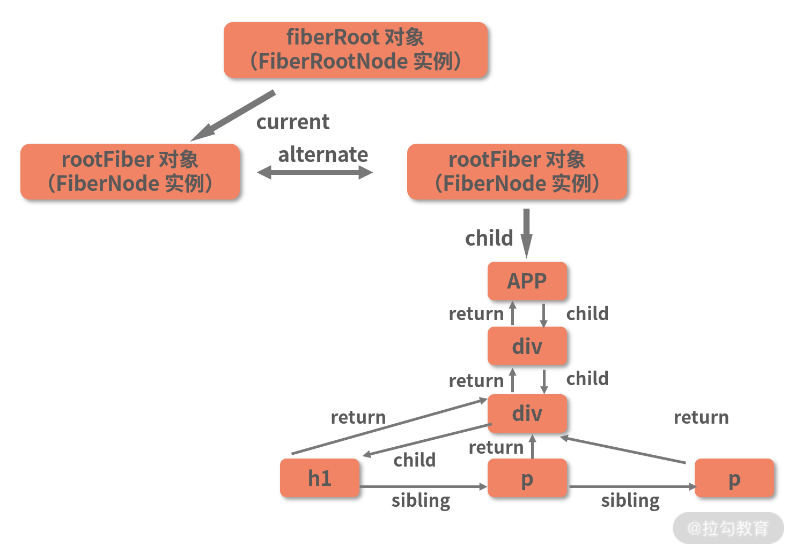
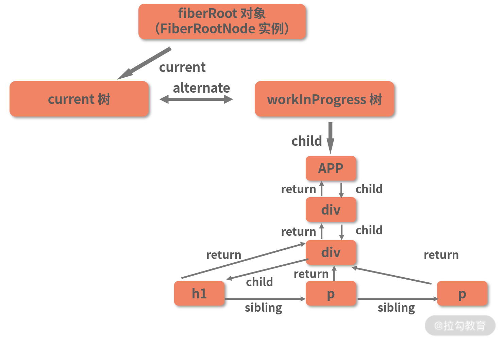
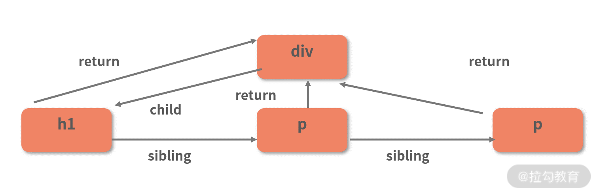
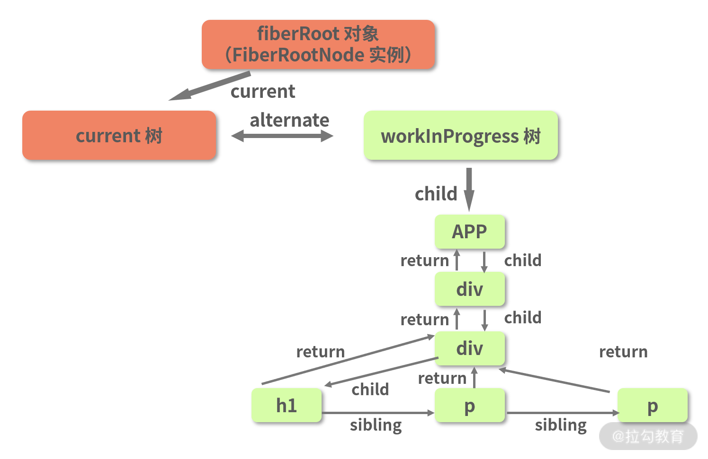
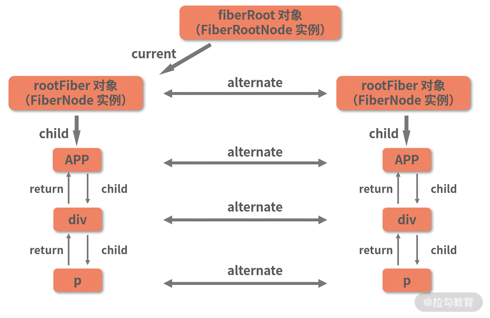

ReactDOM.render 的调用栈划分为三个阶段：

## 1. 初始化阶段

```js
function legacyRenderSubtreeIntoContainer(
  parentComponent,
  children,
  container,
  forceHydrate,
  callback
) {
  // container 对应的是我们传入的真实 DOM 对象
  var root = container._reactRootContainer;
  // 初始化 fiberRoot 对象
  var fiberRoot;
  // DOM 对象本身不存在 _reactRootContainer 属性，因此 root 为空

  if (!root) {
    // 若 root 为空，则初始化 _reactRootContainer，并将其值赋值给 root
    root = container._reactRootContainer = legacyCreateRootFromDOMContainer(
      container,
      forceHydrate
    );
    // legacyCreateRootFromDOMContainer 创建出的对象会有一个 _internalRoot 属性，将其赋值给 fiberRoot
    fiberRoot = root._internalRoot;

    // 这里处理的是 ReactDOM.render 入参中的回调函数，你了解即可
    if (typeof callback === "function") {
      var originalCallback = callback;
      callback = function () {
        var instance = getPublicRootInstance(fiberRoot);
        originalCallback.call(instance);
      };
    } // Initial mount should not be batched.

    // 进入 unbatchedUpdates 方法
    unbatchedUpdates(function () {
      updateContainer(children, fiberRoot, parentComponent, callback);
    });
  } else {
    // else 逻辑处理的是非首次渲染的情况（即更新），其逻辑除了跳过了初始化工作，与楼上基本一致

    fiberRoot = root._internalRoot;

    if (typeof callback === "function") {
      var _originalCallback = callback;

      callback = function () {
        var instance = getPublicRootInstance(fiberRoot);

        _originalCallback.call(instance);
      };
    } // Update

    updateContainer(children, fiberRoot, parentComponent, callback);
  }

  return getPublicRootInstance(fiberRoot);
}
// 清除根节点下的所有元素，创建ReactRoot
function legacyCreateRootFromDOMContainer() {
  const shouldHydrate =
    forceHydrate || shouldHydrateDueToLegacyHeuristic(container);
  if (!shouldHydrate) {
    let rootSibling;
    while ((rootSibling = container.lastChild)) {
      container.removeChild(rootSibling);
    }
  }

  return new ReactSyncRoot(container, LegacyRoot, shouldHydrate);
}
```

完成 fiber 树基本实体的创建

1. 调用 legacyCreateRootFromComContainer ，创建 Container.\_reactRootContainer 对象，并赋值 root
2. 将 root.\_internalRoot 赋值给 fiberRoot
3. 将 fiberRoot 和入参一起传入 updateContainer，作为 unbatchedUpdates 的回调执行

#### fiberRoot

fiberRoot = container.\_reactRootContainer.\_internalRoot , **fiberRoot 的本质是一个 FiberRootNode 实例**，
**fiberRoot.current 是一个 FiberNode 实例,而 FiberNode，正是 Fiber 节点对应的对象类型。current 对象是一个 Fiber 节点，不仅如此，它还是当前 Fiber 树的头部节点。**
rootFiber = fiberRoot.current

**fiberRoot(FiberRootNode 实例)--current-->rootFiber(FiberNode 实例)**

fiberRoot 的关联对象是**真实 DOM 的容器节点**；而 rootFiber 则作为**虚拟 DOM 的根节点**存在。这两个节点，将是后续整棵 Fiber 树构建的起点。

#### FiberNode

- nextEffect 标记具有 DOM 更新或与其关联的其他 effects 的节点, effectList 的连接属性
- effectTag 标记与之相关的 effects
- alternate 备用 fiber 节点， workInProgress 和 current 树的连接属性
- stateNode：保存对组件的类实例，DOM 节点或与 fiber 节点关联的其他 React 元素类型的引用。一般来说，可以认为这个属性用于保存与 fiber 相关的本地状态。

- type：定义与此 fiber 关联的功能或类。对于类组件，它指向构造函数；对于 DOM 元素，它指定 HTML tag。可以使用这个字段来理解 fiber 节点与哪个元素相关。

- tag：定义 fiber 的类型。它在 reconcile 算法中用于确定需要完成的工作。工作取决于 React 元素的类型，函数 createFiberFromTypeAndProps 将 React 元素映射到相应的 fiber 节点类型。在我们的应用程序中，ClickCounter 组件的属性标记是 1，表示 ClassComponent，而 span 元素的属性标记是 5，表示 Host Component。

- updateQueue：用于状态更新，回调函数，DOM 更新的队列

- memoizedState：用于创建输出的 fiber 状态。处理更新时，它会反映当前在屏幕上呈现的状态。

- memoizedProps：在前一次渲染期间用于创建输出的 props

- pendingProps：已从 React 元素中的新数据更新，并且需要应用于子组件或 DOM 元素的 props

- key：具有一组 children 的唯一标识符，可帮助 React 确定哪些项已更改，已添加或从列表中删除。它与此处描述的 React 的“list and key”功能有关。

#### unbatchedUpdates

接下来，fiberRoot 将和 ReactDOM.render 方法的其他入参一起，被传入 updateContainer 方法，从而形成一个回调。这个回调，正是接下来要调用的 unbatchedUpdates 方法的入参。我们一起看看 unbatchedUpdates 做了什么，下面代码是对 unbatchedUpdates 主体逻辑的提取：

```js
function unbatchedUpdates(fn, a) {
  // 这里是对上下文的处理，不必纠结

  var prevExecutionContext = executionContext;
  executionContext &= ~BatchedContext;
  executionContext |= LegacyUnbatchedContext;

  try {
    // 重点在这里，直接调用了传入的回调函数 fn，对应当前链路中的 updateContainer 方法
    return fn(a);
  } finally {
    // finally 逻辑里是对回调队列的处理，此处不用太关注
    executionContext = prevExecutionContext;
    if (executionContext === NoContext) {
      // Flush the immediate callbacks that were scheduled during this batch
      resetRenderTimer();
      flushSyncCallbackQueue();
    }
  }
}
```

在 unbatchedUpdates 函数体里，当下你只需要 Get 到一个信息：它直接调用了传入的回调 fn。而在当前链路中，fn 是什么呢？fn 是一个针对 updateContainer 的调用：接下来我们很有必要去看看 updateContainer 里面的逻辑。

#### updateContainer

```js
function updateContainer(element, container, parentComponent, callback) {
  ......

  // 这是一个 event 相关的入参，此处不必关注
  var eventTime = requestEventTime();
  ......
  // 这是一个比较关键的入参，lane 表示优先级
  var lane = requestUpdateLane(current);
  // 结合 lane（优先级）信息，创建 update 对象，一个 update 对象意味着一个更新
  var update = createUpdate(eventTime, lane);
  // update 的 payload 对应的是一个 React 元素
  update.payload = {
    element: element
  };
  // 处理 callback，这个 callback 其实就是我们调用 ReactDOM.render 时传入的 callback
  callback = callback === undefined ? null : callback;
  if (callback !== null) {
    {
      if (typeof callback !== 'function') {
        error('render(...): Expected the last optional `callback` argument to be a ' + 'function. Instead received: %s.', callback);
      }
    }
    update.callback = callback;
  }
  // 将 update 入队
  enqueueUpdate(current, update);
  // 调度 fiberRoot
  scheduleUpdateOnFiber(current, lane, eventTime);
  // 返回当前节点（fiberRoot）的优先级
  return lane;
}

```

关键步骤：

1. 获取当前 Fiber 节点的的 lane(优先级)
2. 结合 lane,创建当前 fiber 节点的 update 对象，将 update 入队
3. scheduleUpdateOnFiber 调度当前节点（rootFiber）

#### scheduleUpdateOnFiber

scheduleUpdateOnFiber 的任务就是调度当前节点的更新， 在这个函数中，会处理一系列与优先级、打断操作相关的逻辑。但是在 ReactDOM.render 发起的**首次渲染链路中，这些意义都不大，因为这个渲染过程其实是同步的。**

scheduleUpdateOnFiber 中会调用 performSyncWorkOnRoot, performSyncWorkOnRoot 直译过来就是“执行根节点的同步任务”，这里的“同步”二字需要注意，它明示了接下来即将开启的是一个同步的过程。performSyncWorkOnRoot 是 render 阶段的起点，render 阶段的任务就是完成 Fiber 树的构建，它是整个渲染链路中最核心的一环。在异步渲染的模式下，render 阶段应该是一个可打断的异步过程

### 都说 Fiber 架构带来的异步渲染是 React 16 的亮点，为什么分析到现在，竟然发现 ReactDOM.render 触发的首次渲染是个同步过程呢？

**同步的 ReactDom.render，异步的 ReactDom.createRoot**
其实在 React 16，包括近期发布的 React 17 小版本中，React 都有以下 3 种启动方式：

##### 1. legacy 模式：

ReactDOM.render(<App />, rootNode)。这是当前 React App 使用的方式，当前没有计划删除本模式，但是这个模式可能不支持这些新功能。

##### 2. blocking 模式：

ReactDOM.createBlockingRoot(rootNode).render(<App />)。目前正在实验中，作为迁移到 concurrent 模式的第一个步骤。

##### 3. concurrent 模式：

ReactDOM.createRoot(rootNode).render(<App />)。目前在实验中，未来稳定之后，打算作为 React 的默认开发模式，这个模式开启了所有的新功能。

**React 将会通过修改 mode 属性为不同的值，来标识当前处于哪个渲染模式；在执行过程中，也是通过判断这个属性，来区分不同的渲染模式。**
如果想要开启异步渲染，我们需要调用 ReactDOM.createRoot 方法来启动应用， 在异步渲染模式下，由于请求到的 lane 不再是 SyncLane（同步优先级），故不会再走到 performSyncWorkOnRoot 这个调用，而是会转而执行 else 中调度相关的逻辑。

#### Fiber 架构一定是异步渲染吗？

从动机上来看，Fiber 架构的设计确实主要是为了 Concurrent 而存在。在 React 16，包括已发布的 React 17 版本中，不管是否是 Concurrent，整个数据结构层面的设计、包括贯穿整个渲染链路的处理逻辑，已经完全用 Fiber 重构了一遍。站在这个角度来看，**Fiber 架构在 React 中并不能够和异步渲染画严格的等号，它是一种同时兼容了同步渲染与异步渲染的设计。**

## 2. render 阶段

### workInProgress 节点的创建

上面我们提到 performSyncWorkOnRoot 是 render 阶段的起点，这个方法的调用栈 renderRootSync->prepareFreshStack->createWorkProgress， 这里最需要关注的就是 createWorkProgress

```js
// 这里入参中的 current 传入的是现有树结构中的 rootFiber 对象

function createWorkInProgress(current, pendingProps) {
  var workInProgress = current.alternate;
  // ReactDOM.render 触发的首屏渲染将进入这个逻辑
  if (workInProgress === null) {
    // 这是需要你关注的第一个点，workInProgress 是 createFiber 方法的返回值
    workInProgress = createFiber(
      current.tag,
      pendingProps,
      current.key,
      current.mode
    );
    workInProgress.elementType = current.elementType;
    workInProgress.type = current.type;
    workInProgress.stateNode = current.stateNode;
    // 这是需要你关注的第二个点，workInProgress 的 alternate 将指向 current
    workInProgress.alternate = current;
    // 这是需要你关注的第三个点，current 的 alternate 将反过来指向 workInProgress
    current.alternate = workInProgress;
  } else {
    // else 的逻辑此处先不用关注
  }
  // 以下省略大量 workInProgress 对象的属性处理逻辑
  // 返回 workInProgress 节点
  return workInProgress;
}
```

workInProgress -->alternate --> rootFiber
rootFiber --> alternate --> workInProgress

1. createWorkInProgress 将调用 createFiber，workInProgress 是 createFiber 方法的返回值；
2. workInProgress 的 alternate 将指向 current；
3. current 的 alternate 将反过来指向 workInProgress。

```js
var createFiber = function (tag, pendingProps, key, mode) {
  return new FiberNode(tag, pendingProps, key, mode);
};
```

creteFiber 会创建一个 FiberNode 实例。因此本质上 workInProgress 就是一个 Fiber 节点。不仅如此，细心的你可能还会发现 workInProgress 的创建入参其实来源于 current
**workInProgress 节点其实就是 current 节点（即 rootFiber）的副本。**

再结合 current 指向 rootFiber 对象（同样是 FiberNode 实例），以及 current 和 workInProgress 通过 alternate 互相连接这些信息，我们可以分析出这波操作执行完之后，整棵树的结构应该如下图所示：

**fiberRoot(FiberRootNode 实例) --current--> rootFiber(FiberNode 实例) <--alternate-->rootFiber (FiberNode 实例)**

### workLoopSync 循环判断 workInProgress 是否为空，不为空针对它执行 performUnitOfWork 函数

```js
function workLoopSync() {
  // 若 workInProgress 不为空
  while (workInProgress !== null) {
    // 针对它执行 performUnitOfWork 方法
    performUnitOfWork(workInProgress);
  }
}

function performUnitOfWork(unitOfWork) {
  ......
  // 获取入参节点对应的 current 节点
  var current = unitOfWork.alternate;
  var next;
  if (xxx) {
    ...
    // 创建当前节点的子节点
    next = beginWork(current, unitOfWork, subtreeRenderLanes);
    ...
  } else {
    // 创建当前节点的子节点
    next = beginWork(current, unitOfWork, subtreeRenderLanes);
  }
  unitOfWork.memoizedProps = unitOfWork.pendingProps;
  ......
  //// Fiber 树已经更新到叶子节点
  if (next === null) {
    // 调用 completeUnitOfWork
    completeUnitOfWork(unitOfWork);
  } else {
    // 将当前节点更新为新创建出的 Fiber 节点
    workInProgress = next;
  }
  ......
  return next
}
```

而 performUnitOfWork 函数将触发对 beginWork 的调用，进而实现对新 Fiber 节点的创建。若 beginWork 所创建的 Fiber 节点不为空，则 performUniOfWork 会用这个新的 Fiber 节点来更新 workInProgress 的值，为下一次循环做准备。

**通过循环调用 performUnitOfWork 来触发 beginWork，新的 Fiber 节点就会被不断地创建。**当 workInProgress 终于为空时，说明没有新的节点可以创建了，也就意味着已经完成对整棵 Fiber 树的构建。

在这个过程中，**每一个被创建出来的新 Fiber 节点，都会一个一个挂载为最初那个 workInProgress 节点（如下图高亮处）的后代节点**。而上述过程中构建出的这棵 Fiber 树，也正是大名鼎鼎的 **workInProgress 树**。

current 指针所指向的根节点所在的那棵树，我们叫它**current 树**

### beginWork 开启 Fiber 节点创建过程

```js
function beginWork(current, workInProgress, renderLanes) {
  ......
  //  current 节点不为空的情况下，会加一道辨识，看看是否有更新逻辑要处理
  if (current !== null) {
    // 获取新旧 props
    var oldProps = current.memoizedProps;
    var newProps = workInProgress.pendingProps;
    // 若 props 更新或者上下文改变，则认为需要"接受更新"
    if (oldProps !== newProps || hasContextChanged() || (
     workInProgress.type !== current.type )) {
      // 打个更新标
      didReceiveUpdate = true;
    } else if (xxx) {
      // 不需要更新的情况 A
      return A
    } else {
      if (需要更新的情况 B) {
        didReceiveUpdate = true;
      } else {
        // 不需要更新的其他情况，这里我们的首次渲染就将执行到这一行的逻辑
        didReceiveUpdate = false;
      }
    }
  } else {
    didReceiveUpdate = false;
  }
  .....
  // 这坨 switch 是 beginWork 中的核心逻辑，原有的代码量相当大
  switch (workInProgress.tag) {
    ......
    // 这里省略掉大量形如"case: xxx"的逻辑
    // 根节点将进入这个逻辑
    case HostRoot:
      return updateHostRoot(current, workInProgress, renderLanes)
    // dom 标签对应的节点将进入这个逻辑
    case HostComponent:
      return updateHostComponent(current, workInProgress, renderLanes)
    // 文本节点将进入这个逻辑
    case HostText:
      return updateHostText(current, workInProgress)
    ......
    // 这里省略掉大量形如"case: xxx"的逻辑
  }
  // 这里是错误兜底，处理 switch 匹配不上的情况
  {
    {
      throw Error(
        "Unknown unit of work tag (" +
          workInProgress.tag +
          "). This error is likely caused by a bug in React. Please file an issue."
      )
    }
  }
}

```

1. beginWork 的入参是一对用 alternate 连接起来的 workInProgress 和 current 节点；
2. beginWork 的核心逻辑是根据 fiber 节点（workInProgress）的 tag 属性的不同，调用不同的节点创建函数。

在整段 switch 逻辑里，包含的形如“update+类型名”这样的函数是非常多的,这些函数之间不仅命名形式一致，工作内容也相似。就 render 链路来说，它们共同的特性，就是都会通过调用 reconcileChildren 方法，生成当前节点的子节点。

```js
function reconcileChildren(current, workInProgress, nextChildren, renderLanes) {
  // 判断 current 是否为 null
  if (current === null) {
    // 若 current 为 null，则进入 mountChildFibers 的逻辑
    workInProgress.child = mountChildFibers(
      workInProgress,
      null,
      nextChildren,
      renderLanes
    );
  } else {
    // 若 current 不为 null，则进入 reconcileChildFibers 的逻辑
    workInProgress.child = reconcileChildFibers(
      workInProgress,
      current.child,
      nextChildren,
      renderLanes
    );
  }
}
```

### ChildReconciler，处理 Fiber 节点的幕后操手

```js
var reconcileChildFibers = ChildReconciler(true);
var mountChildFibers = ChildReconciler(false);
```

原来 reconcileChildFibers 和 mountChildFibers 不仅名字相似，出处也一致。它们都是 ChildReconciler 这个函数的返回值，仅仅存在入参上的区别。而 ChildReconciler，则是一个实打实的“庞然大物”，其内部的逻辑量堪比 N 个 beginWork。这里我将关键要素提取如下（解析在注释里）：

```js
function ChildReconciler(shouldTrackSideEffects) {
  // 删除节点的逻辑
  function deleteChild(returnFiber, childToDelete) {
    if (!shouldTrackSideEffects) {
      // Noop.
      return;
    }
    // 以下执行删除逻辑
  }
  ......

  // 单个节点的插入逻辑
  function placeSingleChild(newFiber) {
    if (shouldTrackSideEffects && newFiber.alternate === null) {
      newFiber.flags = Placement;
    }
    return newFiber;
  }

  // 插入节点的逻辑
  function placeChild(newFiber, lastPlacedIndex, newIndex) {
    newFiber.index = newIndex;
    if (!shouldTrackSideEffects) {
      // Noop.
      return lastPlacedIndex;
    }
    // 以下执行插入逻辑
  }
  ......
  // 此处省略一系列 updateXXX 的函数，它们用于处理 Fiber 节点的更新

  // 处理不止一个子节点的情况
  function reconcileChildrenArray(returnFiber, currentFirstChild, newChildren, lanes) {
    ......
  }
  // 此处省略一堆 reconcileXXXXX 形式的函数，它们负责处理具体的 reconcile 逻辑
  function reconcileChildFibers(returnFiber, currentFirstChild, newChild, lanes) {
    // 这是一个逻辑分发器，它读取入参后，会经过一系列的条件判断，调用上方所定义的负责具体节点操作的函数
  }

  // 将总的 reconcileChildFibers 函数返回
  return reconcileChildFibers;
}
```

1. 关键的入参 shouldTrackSideEffects，意为“是否需要追踪副作用”，因此 reconcileChildFibers 和 mountChildFibers 的不同，在于**对副作用的处理不同**；
   对副作用的处理不同，到底是哪里不同？以 placeSingleChild 为例

```js
function placeSingleChild(newFiber) {
  if (shouldTrackSideEffects && newFiber.alternate === null) {
    newFiber.flags = Placement;
  }
  return newFiber;
}
```

可以看出，一旦判断 shouldTrackSideEffects 为 false，那么下面所有的逻辑都不执行了，直接返回。那如果执行下去会发生什么呢？简而言之就是给 Fiber 节点打上一个叫“flags”的标记

**flags 是什么**
但在更早一些的版本中，这个属性名叫“effectTag”。Placement 这个 effectTag 的意义，是在渲染器执行时，也就是真实 DOM 渲染时，告诉渲染器：我这里需要新增 DOM 节点。**effectTag 记录的是副作用的类型，而所谓“副作用”，React 给出的定义是“数据获取、订阅或者修改 DOM”等动作**。在这里，Placement 对应的显然是 DOM 相关的副作用操作。

像 Placement 这样的副作用标识，还有很多，它们均以**二进制常量**的形式存在

1. ChildReconciler 中定义了大量如 placeXXX、deleteXXX、updateXXX、reconcileXXX 等这样的函数，这些函数**覆盖了对 Fiber 节点的创建、增加、删除、修改等动作，将直接或间接地被 reconcileChildFibers 所调用**；

1. ChildReconciler 的返回值是一个名为 reconcileChildFibers 的函数，这个函数是一个逻辑分发器，它将根据入参的不同，执行不同的 Fiber 节点操作，最终返回不同的目标 Fiber 节点。

### reconcileChildFibers

结合前面的分析可知，reconcileChildFibers 是 ChildReconciler(true)的返回值。入参为 true，意味着其内部逻辑是允许追踪副作用的，因此“打 effectTag”这个动作将会生效。

接下来进入 reconcileChildFibers 的逻辑，在 reconcileChildFibers 这个逻辑分发器中，会把 rootFiber 子节点的创建工作分发给 reconcileXXX 函数家族的一员——reconcileSingleElement 来处理：

**reconcileSingleElement 将基于 rootFiber 子节点的 ReactElement 对象信息，创建其对应的 FiberNode。**

这里需要说明的一点是：**rootFiber 作为 Fiber 树的根节点，它并没有一个确切的 ReactElement 与之映射。结合 JSX 结构来看，我们可以将其理解为是 JSX 中根组件的父节点**

根组件是一个类型为 App 的函数组件，因此 **rootFiber 就是 App 的父节点**。

结合这个分析来看，图中的 \_created4 是根据 rootFiber 的第一个子节点对应的 ReactElement 来创建的 Fiber 节点，那么它就是 App 所对应的 Fiber 节点。

App 所对应的 Fiber 节点，将被 placeSingleChild 打上“Placement”（新增）的副作用标记，而后作为 reconcileChildFibers 函数的返回值，返回给下图中的 workInProgress.child：

reconcileChildren 函数上下文里的 workInProgress 就是 rootFiber 节点。那么此时，我们就将新创建的 App Fiber 节点和 rootFiber 关联了起来，整个 Fiber 树如下图所示：
**fiberRoot(FiberRootNode 实例)-->current-->rootFiber 对象(FiberNode 实例)<--alternate-->workInProgress(FiberNode 实例)--child-->App(FiberNode 实例)**

### Fiber 节点的创建过程梳理

1. beginWork
2. updateHostRoot ,进入 rootFiber 节点的处理逻辑
3. 调用 reconcileChildren，分发当前节点（rootFiber 节点）的子节点的创建逻辑
4. current 不为 null,逻辑分发 reconcileChildFibers=ChildReconciler(true),副作用被追踪
5. reconcileChildFibers 将子节点的创建逻辑分发给 reconcileSingleElement,得到 App FiberNode
6. App 所对应的 Fiber 节点，将被 placeSingleChild 打上“Placement”（新增）的副作用标记
7. App FiberNode 作为 rootFiber 的 Child 属性，与 workInProgress fiber 建立关联

### Fiber 树的构建过程

#### 循环创建新的 Fiber 节点

上面提到 workLoopSync 会循环地调用 performUnitOfWork，而 performUnitOfWork，开篇我们已经点到过它，其主要工作是“通过调用 beginWork，来实现新 Fiber 节点的创建”；它还有一个次要工作，就是把**新创建的这个 Fiber 节点的值更新到 workInProgress 变量里去**

```js
// 新建 Fiber 节点
next = beginWork(current, unitOfWork, subtreeRenderLanes);
// 将新的 Fiber 节点赋值给 workInProgress
if (next === null) {
  // If this doesn't spawn new work, complete the current work.
  completeUnitOfWork(unitOfWork);
} else {
  workInProgress = next;
}
```

如此便能够确保每次 performUnitOfWork 执行完毕后，当前的 workInProgress 都存储着下一个需要被处理的节点，从而为下一次的 workLoopSync 循环做好准备。

现在我在 workLoopSync 内部打个断点，尝试输出每一次获取到的 workInProgress 的值,你会发现**组件自上而下，每一个非文本类型的 ReactElement 都有了它对应的 Fiber 节点。**

> 注：React 并不会为所有的文本类型 ReactElement 创建对应的 FiberNode，这是一种优化策略。是否需要创建 FiberNode，在源码中是通过 isDirectTextChild 这个变量来区分的。

这样一来，我们构建的这棵树里，就多出了不少 FiberNode

fiberRoot--current-->rootFiber<--alternate--> rootFiber --child--> App div div p

fiber 节点是有了，那这些节点是如何连接的呢

#### Fiber 节点是如何连接的

不同的 Fiber 节点之间，将通过 child、return、sibling 这 3 个属性建立关系，其中 child、return 记录的是父子节点关系，而 sibling 记录的则是兄弟节点关系。


以上便是 workInProgress Fiber 树的最终形态了。从图中可以看出，虽然人们习惯上仍然将眼前的这个产物称为“Fiber 树”，但它的数据结构本质其实已经从树变成了**链表**。

注意，在分析 Fiber 树的构建过程时，我们选取了 beginWork 作为切入点，但整个 Fiber 树的构建过程中，并不是只有 beginWork 在工作。这其中，还穿插着 completeWork 的工作。只有将 completeWork 和 beginWork 放在一起来看，你才能够真正理解，Fiber 架构下的“深度优先遍历”到底是怎么一回事。

### completeWork 将 Fiber 节点映射为 Dom 节点

调用栈中 performUnitOfWork-> completeUnitOfWork ->completeWork
其中 completeUnitOfWork 的工作也非常关键，但眼下我们先拿 completeWork 开刀，你可以暂时将 completeUnitOfWork 简单理解为一个用于发起 completeWork 调用的“工具人”。completeUnitOfWork 是在 performUnitOfWork 中被调用的，那么 performUnitOfWork 是如何把握其调用时机的呢？我们直接来看相关源码（解析在注释里）：

```js
function performUnitOfWork(unitOfWork) {
  ......
  // 获取入参节点对应的 current 节点
  var current = unitOfWork.alternate;
  var next;
  if (xxx) {
    ...
    // 创建当前节点的子节点
    next = beginWork(current, unitOfWork, subtreeRenderLanes);
    ...
  } else {
    // 创建当前节点的子节点
    next = beginWork(current, unitOfWork, subtreeRenderLanes);
  }
  unitOfWork.memoizedProps = unitOfWork.pendingProps;
  ......
  //// Fiber 树已经更新到叶子节点
  if (next === null) {
    // 调用 completeUnitOfWork
    completeUnitOfWork(unitOfWork);
  } else {
    // 将当前节点更新为新创建出的 Fiber 节点
    workInProgress = next;
  }
  ......
  return next
}
```

performUnitOfWork 每次会尝试调用 beginWork 来创建当前节点的子节点，若创建出的子节点为空（也就意味着当前节点不存在子 Fiber 节点），则说明当前节点是一个叶子节点。**按照深度优先遍历的原则，当遍历到叶子节点时，“递”阶段就结束了，随之而来的是“归”的过程。**因此这种情况下，就会调用 completeUnitOfWork，执行当前节点对应的 completeWork 逻辑。

按照深度优先遍历的原则，h1 将是第一个被遍历到的叶子节点。接下来我们就以 h1 为例，一起看看 completeWork 都围绕它做了哪些事情。

### completeWork 的工作原理

```js
function completeWork(current, workInProgress, renderLanes) {

  // 取出 Fiber 节点的属性值，存储在 newProps 里
  var newProps = workInProgress.pendingProps;
  // 根据 workInProgress 节点的 tag 属性的不同，决定要进入哪段逻辑
  switch (workInProgress.tag) {
    case ......:
      return null;
    case ClassComponent:
      {
        .....
      }
    case HostRoot:
      {
        ......
      }
    // h1 节点的类型属于 HostComponent，因此这里为你讲解的是这段逻辑
    case HostComponent:
      {
        popHostContext(workInProgress);
        var rootContainerInstance = getRootHostContainer();
        var type = workInProgress.type;
        // 判断 current 节点是否存在，因为目前是挂载阶段，因此 current 节点是不存在的
        if (current !== null && workInProgress.stateNode != null) {
          updateHostComponent(current, workInProgress, type, newProps, rootContainerInstance);
          if (current.ref !== workInProgress.ref) {
            markRef(workInProgress);
          }
        } else {
          // 这里首先是针对异常情况进行 return 处理
          if (!newProps) {
            if (!(workInProgress.stateNode !== null)) {
              {
                throw Error("We must have new props for new mounts. This error is likely caused by a bug in React. Please file an issue.");
              }
            }
            return null;
          }
          // 接下来就为 DOM 节点的创建做准备了
          var currentHostContext = getHostContext();
          // _wasHydrated 是一个与服务端渲染有关的值，这里不用关注
          var _wasHydrated = popHydrationState(workInProgress);
          // 判断是否是服务端渲染
          if (_wasHydrated) {
            // 这里不用关注，请你关注 else 里面的逻辑
            if (prepareToHydrateHostInstance(workInProgress, rootContainerInstance, currentHostContext)) {
              markUpdate(workInProgress);
            }
          } else {
            // 这一步很关键， createInstance 的作用是创建 DOM 节点
            var instance = createInstance(type, newProps, rootContainerInstance, currentHostContext, workInProgress);
            // appendAllChildren 会尝试把上一步创建好的 DOM 节点挂载到 DOM 树上去
            appendAllChildren(instance, workInProgress, false, false);
            // stateNode 用于存储当前 Fiber 节点对应的 DOM 节点
            workInProgress.stateNode = instance;
            // finalizeInitialChildren 用来为 DOM 节点设置属性
            if (finalizeInitialChildren(instance, type, newProps, rootContainerInstance)) {
              markUpdate(workInProgress);
            }
          }
          ......
        }
        return null;
      }
    case HostText:
      {
        ......
      }

    case SuspenseComponent:
      {
      ......
      }

    case HostPortal:
      ......
      return null;

    case ContextProvider:
      ......
      return null;
    .....
  }
  {
    {
      throw Error("Unknown unit of work tag (" + workInProgress.tag + "). This error is likely caused by a bug in React. Please file an issue.");
    }
  }
}
```

1. completeWork 的核心逻辑是一段体量巨大的 switch 语句，在这段 switch 语句中，completeWork 将**根据 workInProgress 节点的 tag 属性的不同，进入不同的 DOM 节点的创建、处理逻辑。**
2. 在 Demo 示例中，h1 节点的 tag 属性对应的类型应该是 HostComponent，也就是“原生 DOM 元素类型”。

3. completeWork 中的 current、 workInProgress 分别对应的是下图中左右两棵 Fiber 树上的节点： **workInProgress 树表示当前正在 render 中的树，current 表示已经存在的树**
   

workInProgress 节点和 current 节点之间用 alternate 属性相互连接。**在组件的挂载阶段，current 树只有一个 rootFiber 节点**，并没有其他内容。因此 h1 这个 workInProgress 节点对应的 current 节点是 null。
带着上面这些前提，再去结合注释读一遍上面提炼出来的源码，思路是不是就清晰多了？

捋顺思路后，我们直接来提取知识点。关于 completeWork，你需要明白以下几件事。

1. 用一句话来总结 completeWork 的工作内容：**负责处理 Fiber 节点到 DOM 节点的映射逻辑。**
2. completeWork 内部有 3 个关键动作：

- 创建 DOM 节点（CreateInstance）
- 将 DOM 节点插入到 DOM 树中（AppendAllChildren）
- 为 DOM 节点设置属性（FinalizeInitialChildren）

3. 创建好的 Dom 节点赋值给 workInProgress.stateNode 属性，也就是说当我们想要定位一个 Fiber 对应的 DOM 节点时，访问它的 stateNode 属性就可以了

4. 说是将 DOM 节点插入到 DOM 树里去，实际上是**将子 Fiber 节点所对应的 DOM 节点挂载到其父 Fiber 节点所对应的 DOM 节点里去**。比如说在本讲 Demo 所构建出的 Fiber 树中，h1 节点的父结点是 div，那么 h1 对应的 DOM 节点就理应被挂载到 div 对应的 DOM 节点里去。

### completeUnitOfWork 开启 effectList 的大循环

completeUnitOfWork 的作用是开启一个大循环，在这个大循环中，将会重复地做下面三件事：

1. 对传入的当前节点，调用 completeWork,处理 Fiber 节点到 Dom 节点的映射
2. 将当前节点的副作用链 effectList 插入到其父节点对应的父作用链 effectList
3. 以当前节点为起点，**循环遍历其兄弟节点及其父节点**。当遍历到兄弟节点时，将 return 掉当前调用，触发兄弟节点对应的 performUnitOfWork 逻辑；而遍历到父节点时，则会直接进入下一轮循环，也就是重复 1、2 的逻辑。

#### completeUnitOfWork 开启下一轮循环的原则

在理解副作用链之前，首先要理解 completeUnitOfWork 开启下一轮循环的原则，也就是步骤 3。

```js
do {
  ......
  // 这里省略步骤 1 和步骤 2 的逻辑
  // 获取当前节点的兄弟节点
  var siblingFiber = completedWork.sibling;
  // 若兄弟节点存在
  if (siblingFiber !== null) {
    // 将 workInProgress 赋值为当前节点的兄弟节点
    workInProgress = siblingFiber;
    // 将正在进行的 completeUnitOfWork 逻辑 return 掉
    return;
  }

  // 若兄弟节点不存在，completeWork 会被赋值为 returnFiber，也就是当前节点的父节点
  completedWork = returnFiber;
  // 这一步与上一步是相辅相成的，上下文中要求 workInProgress 与 completedWork 保持一致
  workInProgress = completedWork;
} while (completedWork !== null);
```

当前节点处理完了，自然是去寻找下一个可以处理的节点。我们知道，当前的 Fiber 节点之所以会进入 completeWork，是因为“递无可递”了，才会进入“归”的逻辑，这就意味着当前 Fiber 要么没有 child 节点、要么 child 节点的 completeWork 早就执行过了。因此 **child 节点不会是下次循环需要考虑的对象，下次循环只需要考虑兄弟节点（siblingFiber）和父节点（returnFiber）。**



结合前面的分析和图示可知，h1 节点是递归过程中所触及的第一个叶子节点，也是其兄弟节点中被遍历到的第一个节点；而剩下的两个 p 节点，此时都还没有被遍历到，也就是说连 beginWork 都没有执行过。

因此**对于 h1 节点的兄弟节点来说，当下的第一要务是回去从 beginWork 开始走起，直到 beginWork “递无可递”时，才能够执行 completeWork 的逻辑。**beginWork 的调用是在 performUnitOfWork 里发生的，因此 completeUnitOfWork 一旦识别到当前节点的兄弟节点不为空，就会终止后续的逻辑，退回到上一层的 performUnitOfWork 里去。

接下来我们再来看 h1 的父节点 div：在向下递归到 h1 的过程中，div 必定已经被遍历过了，也就是说 div 的“递”阶段（ beginWork） 已经执行完毕，只剩下“归”阶段的工作要处理了。因此，对于父节点，completeUnitOfWork 会毫不犹豫地把它推到下一次循环里去，让它进入 completeWork 的逻辑。

值得注意的是，completeUnitOfWork 中处理兄弟节点和父节点的顺序是：先检查兄弟节点是否存在，若存在则优先处理兄弟节点；确认没有待处理的兄弟节点后，才转而处理父节点。这也就意味着，**completeWork 的执行是严格自底向上的，子节点的 completeWork 总会先于父节点执行。**

### 副作用链 effectList 的设计和实现

无论是 beginWork 还是 completeWork，它们的应用对象都是 workInProgress 树上的节点。我们说 render 阶段是一个递归的过程，“递归”的对象，正是这棵 workInProgress 树（见下图右侧高亮部分）：

那么我们递归的目的是什么呢？或者说，render 阶段的工作目标是什么呢？

#### render 阶段的工作目标是找出界面中需要处理的更新。

在实际的操作中，并不是所有的节点上都会产生需要处理的更新。比如在挂载阶段，对图中的整棵 workInProgress 递归完毕后，React 会发现实际只需要对 App 节点执行一个挂载操作就可以了；而在更新阶段，这种现象更为明显。

**更新阶段与挂载阶段的主要区别在于更新阶段的 current 树不为空**，比如说情况可以是下图这样子的：



假如说我的某一次操作，仅仅对 p 节点产生了影响，那么对于渲染器来说，它理应只关注 p 节点这一处的更新。这时候问题就来了：**怎样做才能让渲染器又快又好地定位到那些真正需要更新的节点呢？**

在 render 阶段，我们通过艰难的递归过程来明确“p 节点这里有一处更新”这件事情。按照 React 的设计思路，render 阶段结束后，“找不同”这件事情其实也就告一段落了。**commit 只负责实现更新，而不负责寻找更新，这就意味着我们必须找到一个办法能让 commit 阶段“坐享其成”，能直接拿到 render 阶段的工作成果。而这，正是副作用链（effectList）的价值所在。**

**副作用链（effectList） 可以理解为 render 阶段“工作成果”的一个集合**：每个 Fiber 节点都维护着一个属于它自己的 effectList，effectList 在数据结构上以链表的形式存在，链表内的每一个元素都是一个 Fiber 节点。这些 Fiber 节点需要满足两个共性：

1. 都是当前 Fiber 节点的后代节点
2. 都有待处理的副作用
   没错，**Fiber 节点的 effectList 里记录的并非它自身的更新**，而是其需要更新的后代节点。带着这个结论，我们再来品品小节开头 completeUnitOfWork 中的“步骤 2”：

**将当前节点的副作用链（effectList）插入到其父节点对应的副作用链（effectList）中。**

咱们前面已经分析过**completeWork 是自底向上执行的**，也就是说，子节点的 completeWork 总是比父节点先执行。试想，若每次处理到一个节点，都将当前节点的 effectList 插入到其父节点的 effectList 中。那么当所有节点的 completeWork 都执行完毕时，我是不是就可以从“终极父节点”，也就是 **rootFiber 上，拿到一个存储了当前 Fiber 树所有 effect Fiber 的“终极版”的 effectList 了**？

把所有需要更新的 Fiber 节点单独串成一串链表，方便后续有针对性地对它们进行更新，这就是所谓的“收集副作用”的过程。

首先我们要知道的是，这个 effectList 链表在 Fiber 节点中是通过 firstEffect 和 lastEffect 来维护的

其中 firstEffect 表示 effectList 的第一个节点，而 lastEffect 则记录最后一个节点。

**对于挂载过程来说，我们唯一要做的就是把 App 组件挂载到界面上去，因此 App 后代节点们的 effectList 其实都是不存在的。effectList 只有在 App 的父节点（rootFiber）这才不为空。**

那么 effectList 的创建逻辑又是怎样的呢？其实非常简单，只需要为 firstEffect 和 lastEffect 各赋值一个引用即可。以下是从 completeUnitOfWork 源码中提取出的相关逻辑（解析在注释里）：

```js
// 若副作用类型的值大于“PerformedWork”，则说明这里存在一个需要记录的副作用

if (flags > PerformedWork) {
  // returnFiber 是当前节点的父节点
  if (returnFiber.lastEffect !== null) {
    // 若父节点的 effectList 不为空，则将当前节点追加到 effectList 的末尾去
    returnFiber.lastEffect.nextEffect = completedWork;
  } else {
    // 若父节点的 effectList 为空，则当前节点就是 effectList 的 firstEffect
    returnFiber.firstEffect = completedWork;
  }
  // 将 effectList 的 lastEffect 指针后移一位
  returnFiber.lastEffect = completedWork;
}
```

代码中的 flags 咱们已经反复强调过了，它旧时的名字叫“effectTag”，是用来标识副作用类型的；而“completedWork”这个变量，在当前上下文中存储的就是“正在被执行 completeWork 相关逻辑”的节点；至于“PerformedWork”，它是一个值为 1 的常量，React 规定若 flags（又名 effectTag）的值小于等于 1，则不必提交到 commit 阶段。因此 completeUnitOfWork 只会对 flags 大于 PerformedWork 的 effect fiber 进行收集。

结合这些信息，再去读一遍源码片段，相信你的理解过程就会很流畅了。这里我以 App 节点为例，带你走一遍 effectList 的创建过程：

1. App FiberNode 的 flags 属性为 3，大于 PerformedWork，因此会进入 effectList 的创建逻辑；

2. 创建 effectList 时，并不是为当前 Fiber 节点创建，而是为它的父节点创建，App 节点的父节点是 rootFiber，rootFiber 的 effectList 此时为空；

3. rootFiber 的 firstEffect 和 lastEffect 指针都会指向 App 节点，App 节点由此成为 effectList 中的唯一一个 FiberNode，如下图所示。
   rootFiber---firstEffect-->App， rootFiber--->lastEffect--->APP

#### 小结

在 render 阶段时，React 通过 setState 或 React.render 来执行组件的更新，并确定需要在 UI 中更新的内容。如果是第一次渲染，React 会为 render 方法返回的每个元素，创建一个新的 fiber 节点。在接下来的更新中，将重用和更新现有 React 元素的 fiber 节点。**render 阶段的结果是生成一个部分节点标记了 side effects 的 fiber 节点树，side effects 描述了在下一个 commit 阶段需要完成的工作**。在此阶段，React 采用标有 side effects 的 fiber 树并将其应用于实例。它遍历 side effects 列表并执行 DOM 更新和用户可见的其他更改。

一个很重要的点是，**render 阶段可以异步执行**。 React 可以根据可用时间来处理一个或多个 fiber 节点，然后停止已完成的工作，并让出调度权来处理某些事件。然后它从它停止的地方继续。但有时候，它可能需要丢弃完成的工作并再次从头。由于在 render 阶段执行的工作不会导致任何用户可见的更改（如 DOM 更新），因此这些暂停是不会有问题的。

## 3. commit 阶段工作流简析

commit 阶段是将调和阶段的更新进行提交，即把更新操作反映到真实的 DOM 上。同时，**commit 阶段是同步执行，不可被中断**。
在提交阶段运行的主要功能是 commitRoot。它会执行以下操作:

1. 在标记了 Snapshot effect 的节点上使用 getSnapshotBeforeUpdate 生命周期方法
2. 在标记了 Deletion effect 的节点上调用 componentWillUnmount 生命周期方法
3. 执行所有 DOM 插入，更新和删除
4. 将 finishedWork 树设置为 current 树
5. 在标记了 Placement effect 的节点上调用 componentDidMount 生命周期方法
6. 在标记了 Update effect 的节点上调用 componentDidUpdate 生命周期方法

##### 三个阶段

1. 第一次遍历 effects list（commitBeforeMutationEffects），这个阶段 DOM 节点还没有被渲染到界面上去，过程中会触发 getSnapshotBeforeUpdate，也会处理 useEffect 钩子相关的调度逻辑。

2. 第二次遍历 effects list（commitMutationEffects）：此阶段是真正更改 DOM 的阶段；

3. 第三次遍历 effects list（commitLayoutEffects）：执行生命周期函数 componentDidMount、componentDidUpdate...，调用 useLayoutEffect 钩子函数的回调等。除了这些之外，它还会把 fiberRoot 的 current 指针指向 workInProgress Fiber 树。

```js
// packages/react-reconciler/src/ReactFiberWorkLoop.js
function commitRootImpl() {
  // ...
  // 三次遍历 effects list
  do {
    commitBeforeMutationEffects();
  } while (nextEffect !== null);
  do {
    commitMutationEffects(renderPriorityLevel);
  } while (nextEffect !== null);
  do {
    commitLayoutEffects(root, expirationTime);
  } while (nextEffect !== null);
}
```

这些子函数中的每一个都实现了一个循环，该循环遍历 effects list 并检查 effect 的类型, 当它找到与函数功能相关的 effects 时，就会执行它.

### commitBeforeMutationEffects

通过 prevProps、prevState 以获取 Snapshot；调用组件实例的 **getSnapshotBeforeUpdate**，返回值用于 componentDidUpdate 的第三个参数。

```js
// packages/react-reconciler/src/ReactFiberCommitWork.js
function commitBeforeMutationLifeCycles() {
  // ...
  switch (finishedWork.tag) {
    case ClassComponent: {
      if (current !== null) {
        // pervProps、pervState
        const prevProps = current.memoizedProps;
        const prevState = current.memoizedState;
        startPhaseTimer(finishedWork, "getSnapshotBeforeUpdate");
        // getSnapshotBeforeUpdate
        const snapshot = instance.getSnapshotBeforeUpdate(
          finishedWork.elementType === finishedWork.type
            ? prevProps
            : resolveDefaultProps(finishedWork.type, prevProps),
          prevState
        );
      }
    }
  }
}
```

### commitMutationEffects

根据不同的 effectTag 执行不同的操作：

- 插入节点：commitPlacement
- 更新节点：commitWork
- 删除节点：commitDeletion

```js
function commitMutationEffects() {
  // ...
  switch (primaryEffectTag) {
    case Placement: {
      commitPlacement(nextEffect);
      break;
    }
    case PlacementAndUpdate: {
      commitPlacement(nextEffect);
      // Update
      const current = nextEffect.alternate;
      commitWork(current, nextEffect);
      break;
    }
    case Update: {
      const current = nextEffect.alternate;
      commitWork(current, nextEffect);
      break;
    }
    case Deletion: {
      commitDeletion(nextEffect, renderPriorityLevel);
      break;
    }
  }
}
```

### commitLayoutEffects

执行 componentDidMount、componentDidUpdate

```js
// packges/react-reconciler/src/ReactFiberWorkLoop.js
function commitLayoutEffects() {
  while (nextEffect !== null) {
    if (effectTag & (Update | Callback)) {
      recordEffect();
      const current = nextEffect.alternate;
      commitLifeCycles(root, current, nextEffect, committedExpirationTime);
    }
  }
}
// packages/react-reconciler/src/ReactFiberCommitWork.js
function commitLifeCycles() {
  switch (finishedWork.tag) {
    // ...
    case ClassComponent: {
      const instance = finishedWork.stateNode;
      if (finishedWork.effectTag & Update) {
        if (current === null) {
          startPhaseTimer(finishedWork, "componentDidMount");
        } else {
          const prevProps =
            finishedWork.elementType === finishedWork.type
              ? current.memoizedProps
              : resolveDefaultProps(finishedWork.type, current.memoizedProps);
          const prevState = current.memoizedState;
          startPhaseTimer(finishedWork, "componentDidUpdate");
        }
      }
    }
  }
}
```

## 参考文章

- [React 16 渲染流程](https://zhuanlan.zhihu.com/p/103506207)
- [[译]深入 React fiber 架构及源码](https://zhuanlan.zhihu.com/p/57346388)
