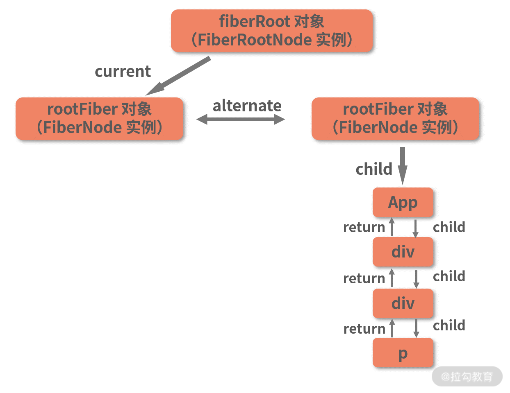
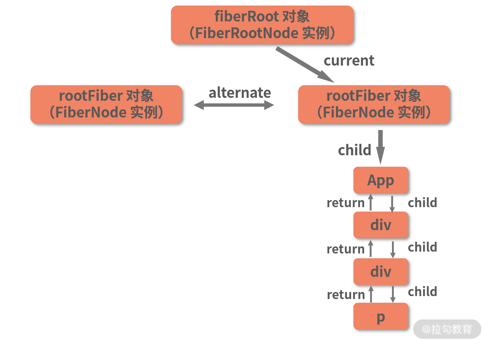
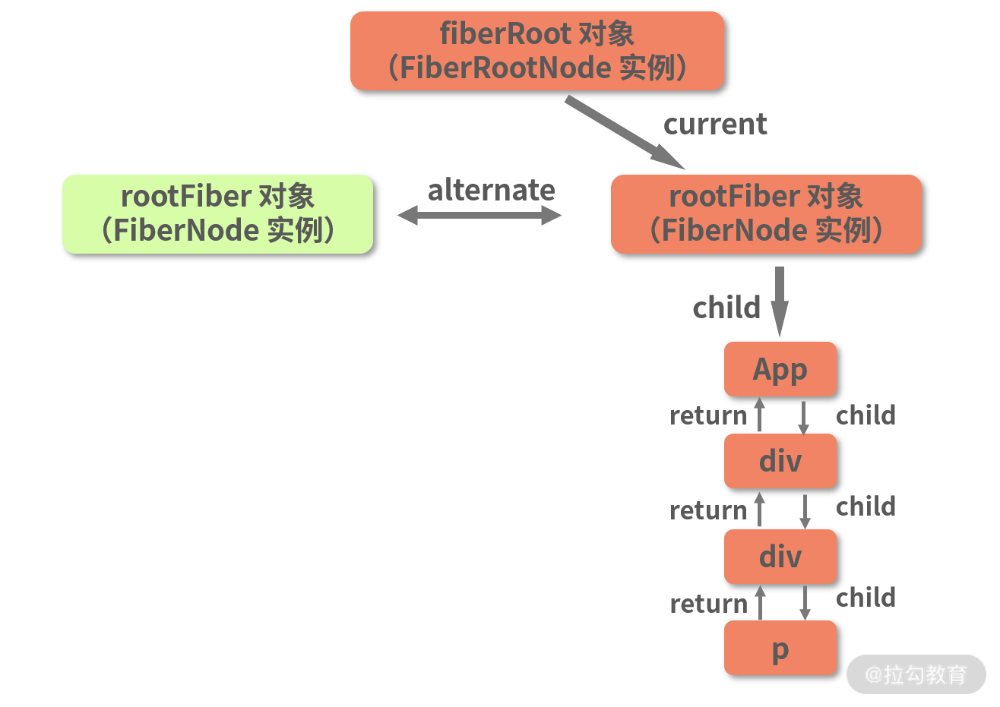
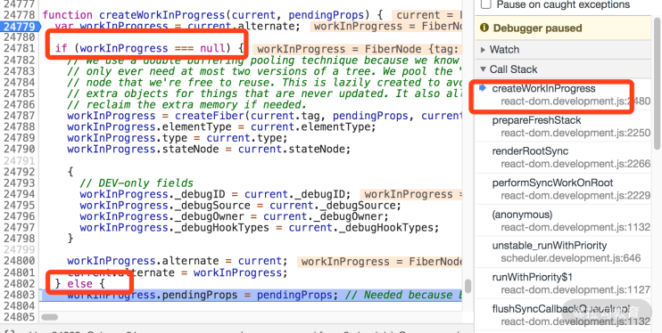
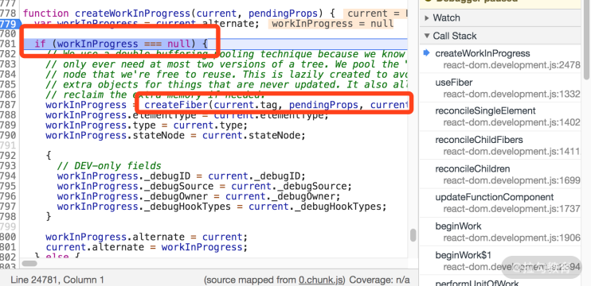
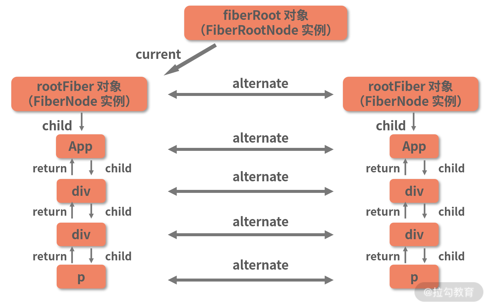
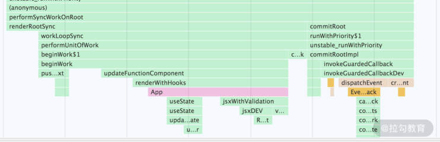
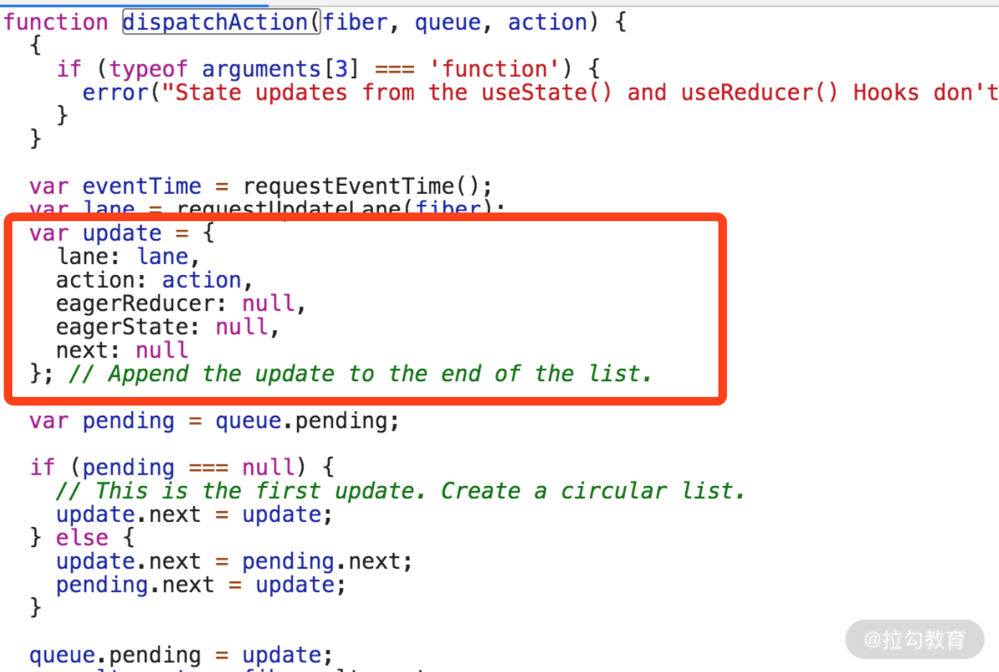
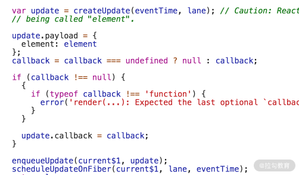
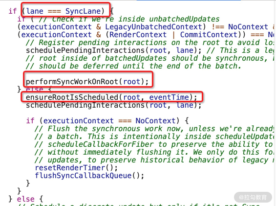

## current 树与 workInProgress 树，双缓冲模式在 fiber 架构下的实现

在 React 中，current 树与 workInProgress 树，两棵树可以对标“双缓冲”模式下的两套缓冲数据：**当 current 树呈现在用户眼前时，所有的更新都会由 workInProgress 树来承接**。workInProgress 树将会在用户看不到的地方（内存里）悄悄地完成所有改变，直到“灯光”打到它身上，也就是 current 指针指向它的时候，此时就意味着 commit 阶段已经执行完毕，workInProgress 树变成了那棵呈现在界面上的 current 树。

接下来我将用一个 Demo，带你切身感受一把 workInProgress 树和 current 树“相互利用”的过程。代码如下：

```js
import { useState } from "react";
function App() {
  const [state, setState] = useState(0);
  return (
    <div className="App">
      <div
        onClick={() => {
          setState(state + 1);
        }}
        className="container"
      >
        <p style={{ width: 128, textAlign: "center" }}>{state}</p>
      </div>
    </div>
  );
}

export default App;
```

每点击数字 0 一下，它的值就会 +1，这就是我们的更新动作。

### 挂载后的 Fiber 树

关于 Fiber 树的构建过程，前面已经详细讲解过，这里不再重复。下面我直接为你展示挂载时的 render 阶段结束后，commit 执行前，两棵 Fiber 树的形态，如下图所示：

待 commit 阶段完成后，右侧的 workInProgress 树对应的 DOM 树就被真正渲染到了页面上，此时 current 指针会指向 workInProgress 树：


由于挂载是一个从无到有的过程，在这个过程中我们是在不断地创建新节点，因此还谈不上什么“节点复用”。节点复用要到更新过程中去看。

### 第一次更新

现在我点击数字 0，触发一次更新。这次更新中，下图高亮的 rootFiber 节点就会被复用：


这段复用的逻辑在 beginWork 调用链路中的 createWorkInProgress 方法里。这里我为你截取了 createWorkInProgress 方法里面一段非常关键的逻辑，请看下图：


在 createWorkInProgress 方法中，会先取当前节点的 alternate 属性，将其记为 workInProgress 节点。对于 rootFiber 节点来说，它的 alternate 属性，其实就是上一棵 current 树的 rootFiber

**当检查到上一棵 current 树的 rootFiber 存在时，React 会直接复用这个节点，让它作为下一棵 workInProgress 的节点存在下去**，也就是说会走进 createWorkInProgress 的 else 逻辑里去。如果它和目标的 workInProgress 节点之间存在差异，直接在该节点上修改属性、使其与目标节点一致即可，而不必再创建新的 Fiber 节点。

至于剩下的 App、div、p 等节点，由于没有对应的 alternate 节点存在，因此它们的 createWorkInProgress 调用会走进下图高亮处的逻辑中：

在这段逻辑里，将调用 createFiber 来新建一个 FiberNode。

第一次更新结束后，我们会得到一棵新的 workInProgress Fiber 树，current 指针最后将会指向这棵新的 workInProgress Fiber 树，如下图所示：


### 第二次更新

接下来我们再次点击数字 1，触发 state 的第二次更新。

在这次更新中，current 树中的每一个 alternate 属性都不为空（如上图所示）。因此每次通过 beginWork 触发 createWorkInProgress 调用时，都会一致地走入 else 里面的逻辑，也就是直接复用现成的节点。

以上便是 current 树和 work 树相互“打配合”，实现节点复用的过程。

## 更新链路要素拆解

其实，挂载可以理解为一种特殊的更新，ReactDOM.render 和 setState 一样，也是一种触发更新的姿势。在 React 中，ReactDOM.render、setState、useState 等方法都是可以触发更新的，这些方法发起的调用链路很相似，是因为它们最后“殊途同归”，**都会通过创建 update 对象来进入同一套更新工作流。**


### update 的创建

点击数字后，点击相关的回调被执行，它首先触发的是 dispatchAction 这个方法
dispatchAction ->performSyncWorkOnRoot(render 阶段)->commit 阶段
dispatchAction 中，会完成 update 对象的创建，如下图标红处所示：


### 从 update 对象到 scheduleUpdateOnFiber

等等，这段逻辑你是否觉得似曾相识？如果你对 ReactDOM.render 系列的第一课时还有印象的话，我希望你能回忆起 updateContainer 这个方法。在 updateContainer 中，React 曾经有过性质一模一样的行为，这里我为你截取了 updateContainer 函数中的相关逻辑：

以 enqueueUpdate 为界，它一共做了以下三件事。

1. enqueueUpdate 之前：**创建 update**。

2. enqueueUpdate 调用：**将 update 入队**。这里简单说下，**每一个 Fiber 节点都会有一个属于它自己的 updateQueue，用于存储多个更新，这个 updateQueue 是以链表的形式存在的。在 render 阶段，updateQueue 的内容会成为 render 阶段计算 Fiber 节点的新 state 的依据。**

3. scheduleUpdateOnFiber：**调度 update**。如果你对之前学过的知识还有印象，会记得同步挂载链路中，这个方法后面紧跟的就是 performSyncWorkOnRoot 所触发的 render 阶段

现在我们再回过头来看 dispatchAction 的逻辑，你会发现 dispatchAction 里面同样有对这三个动作的处理。上面我对 dispatchAction 的局部截图，**包含了对 update 对象的创建和入队处理。dispatchAction 的更新调度动作**，在函数的末尾，如下所示：

```js
scheduleUpdateOnFiber(fiber, lane, eventTime);
```

这里有一个点需要提示一下：**dispatchAction 中，调度的是当前触发更新的节点**，这一点和挂载过程需要区分开来。在挂载过程中，updateContainer 会直接调度根节点。其实，对于更新这种场景来说，大部分的更新动作确实都不是由根节点触发的，而**render 阶段的起点则是根节点**。因此在 scheduleUpdateOnFiber 中，有这样一个方法 markUpdateLaneFromFiberToRoot 将会从当前 Fiber 节点开始，向上遍历直至根节点，并将根节点返回。

### scheduleUpdateOnFiber 如何区分同步还是异步？



这是 scheduleUpdateOnFiber 中的一段逻辑。在同步的渲染链路中，lane === SyncLane 这个条件是成立的，因此会直接进入 performSyncWorkOnRoot 的逻辑，开启同步的 render 流程；而在异步渲染模式下，则将进入 else 的逻辑。

在 else 中，需要引起你注意的是 **ensureRootIsScheduled 这个方法，该方法很关键，它将决定如何开启当前更新所对应的 render 阶段**。在 ensureRootIsScheduled 中，有这样一段核心逻辑

```js
if (newCallbackPriority === SyncLanePriority) {
  // 同步更新的 render 入口
  newCallbackNode = scheduleSyncCallback(
    performSyncWorkOnRoot.bind(null, root)
  );
} else {
  // 将当前任务的 lane 优先级转换为 scheduler 可理解的优先级
  var schedulerPriorityLevel =
    lanePriorityToSchedulerPriority(newCallbackPriority);
  // 异步更新的 render 入口
  newCallbackNode = scheduleCallback(
    schedulerPriorityLevel,
    performConcurrentWorkOnRoot.bind(null, root)
  );
}
```

请你关注 **performSyncWorkOnRoot 和 performConcurrentWorkOnRoot 这两个方法：前者是同步更新模式下的 render 阶段入口；而后者是异步模式下的 render 阶段入口。**

从这段逻辑中我们可以看出，React 会以当前更新任务的优先级类型为依据，决定接下来是调度 performSyncWorkOnRoot 还是 performConcurrentWorkOnRoot。这里调度任务用到的函数分别是 scheduleSyncCallback 和 scheduleCallback，这两个函数在内部都是通过调用 **unstable_scheduleCallback** 方法来执行任务调度的。而 unstable_scheduleCallback 正是 Scheduler（调度器）中导出的一个核心方法，也是本讲的一个重点。

在解读 unstable_scheduleCallback 的工作原理之前，我们先来一起认识一下 Scheduler。

### Scheduler ---“时间切片”与“优先级”的幕后推手

#### 结合 React 调用栈，理解时间切片现象

```js
import React from "react";

function App() {
  const arr = new Array(1000).fill(0);

  const renderContent = arr.map((i, index) => (
    <p style={{ width: 128, textAlign: "center" }}>{`测试文本第${index}行`}</p>
  ));

  return (
    <div className="App">
      <div className="container">{renderContent}</div>
    </div>
  );
}

export default App;
```

在 reactDom.render
这个 Task 的执行时长在 130ms 以上（将鼠标悬浮在 Task 长条上就可以查看执行时长）。而浏览器的刷新频率为 60Hz，也就是说每 16.6ms 就会刷新一次。在这 16.6ms 里，除了 JS 线程外，渲染线程也是有工作要处理的，但**超长的 Task 显然会挤占渲染线程的工作时间，引起“掉帧”**，进而带来卡顿的风险，这也正是第 12 讲中所提到的“JS 对主线程的超时占用”问题

若将 ReactDOM.render 调用改为 createRoot 调用（即开启 Concurrent 模式）

你会发现那一个不间断的 Task 长条（大任务），如今像是被“切”过了一样，已经变成了多个断断续续的 Task “短条”（小任务），单个短 Task 的执行时长在我的浏览器中是 5ms 左右。这些短 Task 的工作量加起来，和之前长 Task 工作量是一样的。但短 Task 之间留出的时间缝隙，却给了浏览器喘息的机会，这就是所谓的“时间切片”效果。

#### 时间切片如何实现的

在同步渲染中，循环创建 Fiber 节点、构建 Fiber 树的过程是由 workLoopSync 函数来触发的。这里我们来复习一下 workLoopSync 的源码：

```js
function workLoopSync() {
  while (workInProgress !== null) {
    performUnitWork(workInProgress);
  }
}
```

在 workLoopSync 中，只要 workInProgress 不为空，while 循环就不会结束，它所触发的是一个同步的 performUnitOfWork 循环调用过程。

而在异步渲染模式下，这个循环是由 workLoopConcurrent 来开启的。workLoopConcurrent 的工作内容和 workLoopSync 非常相似，仅仅在循环判断上有一处不同：

```js
function workLoopConcurrent() {
  while (workInProgress !== null && !shouldYield()) {
    performUnitWork(workInProgress);
  }
}
```

shouldYield 直译过来的话是“需要让出”。顾名思义，**当 shouldYield() 调用返回为 true 时，就说明当前需要对主线程进行让出了，此时循环的判断条件整体为 false，while 循环将不再继续。**
那么这个 shouldYield 又是何方神圣呢？在源码中，我们可以寻得这样两行赋值语句：

```js
var Scheduler_shouldYield = Scheduler.unstable_shouldYield,
// ......
var shouldYield = Scheduler_shouldYield;
```

从这两行代码中我们可以看出，shouldYield 的本体其实是 **Scheduler.unstable_shouldYield**，也就是 Scheduler 包中导出的 unstable_shouldYield 方法，该方法本身比较简单

```js
exports.unstable_shouldYield = function () {
  return exports.unstable_now() > deadline;
};
```

其中 **unstable_now 这里实际取的就是 performance.now() 的值，即“当前时间”。那么 deadline 又是什么呢？它可以被理解为当前时间切片的到期时间**，它的计算过程在 Scheduler 包中的 performWorkUntilDeadline 方法里可以找到，也就是下图的标\*：

```js
var performWorkUntilDeadline = function() {
  if(scheduledHostCallback !== null) {
    var currentTime = export.unstable_now();
    deadline = currentTime + yieldInterval; //****
    try{
      var hasMoreWork = scheduledHostCallback(hasTimeRemaining)
      if(!hasMoreWork) {
        isMessageLoopRunning = false
      }
    }
  }
}
```

在这行算式里，currentTime 是当前时间，yieldInterval 是时间切片的长度。注意，**时间切片的长度并不是一个常量**，它是由 React 根据浏览器的帧率大小计算所得出来的，与浏览器的性能有关。

现在我们来总结一下时间切片的实现原理：**React 会根据浏览器的帧率，计算出时间切片的大小，并结合当前时间计算出每一个切片的到期时间。在 workLoopConcurrent 中，while 循环每次执行前，会调用 shouldYield 函数来询问当前时间切片是否到期，若已到期，则结束循环、出让主线程的控制权。**

#### 优先级调度是如何实现的

我们已经知道，无论是 scheduleSyncCallback 还是 scheduleCallback，最终都是通过调用 unstable_scheduleCallback 来发起调度的。**unstable_scheduleCallback 是 Scheduler 导出的一个核心方法，它将结合任务的优先级信息为其执行不同的调度逻辑。**

```js
function unstable_scheduleCallback(priorityLevel, callback, options) {
  // 获取当前时间
  var currentTime = exports.unstable_now();
  // 声明 startTime，startTime 是任务的预期开始时间
  var startTime;
  // 以下是对 options 入参的处理
  if (typeof options === 'object' && options !== null) {
    var delay = options.delay;
    // 若入参规定了延迟时间，则累加延迟时间
    if (typeof delay === 'number' && delay > 0) {
      startTime = currentTime + delay;
    } else {
      startTime = currentTime;
    }
  } else {
    startTime = currentTime;
  }
  // timeout 是 expirationTime 的计算依据
  var timeout;
  // 根据 priorityLevel，确定 timeout 的值
  switch (priorityLevel) {
    case ImmediatePriority:
      timeout = IMMEDIATE_PRIORITY_TIMEOUT;
      break;
    case UserBlockingPriority:
      timeout = USER_BLOCKING_PRIORITY_TIMEOUT;
      break;
    case IdlePriority:
      timeout = IDLE_PRIORITY_TIMEOUT;
      break;
    case LowPriority:
      timeout = LOW_PRIORITY_TIMEOUT;
      break;
    case NormalPriority:
    default:
      timeout = NORMAL_PRIORITY_TIMEOUT;
      break;
  }
  // 优先级越高，timout 越小，expirationTime 越小
  var expirationTime = startTime + timeout;
  // 创建 task 对象
  var newTask = {
    id: taskIdCounter++,
    callback: callback,
    priorityLevel: priorityLevel,
    startTime: startTime,
    expirationTime: expirationTime,
    sortIndex: -1
  };
  {
    newTask.isQueued = false;
  }
  // 若当前时间小于开始时间，说明该任务可延时执行(未过期）
  if (startTime > currentTime) {
    // 将未过期任务推入 "timerQueue"
    newTask.sortIndex = startTime;
    push(timerQueue, newTask);
    // 若 taskQueue 中没有可执行的任务，而当前任务又是 timerQueue 中的第一个任务,peek() 的入参是一个小顶堆，它将取出这个小顶堆的堆顶元素。
    if (peek(taskQueue) === null && newTask === peek(timerQueue)) {
      ......
          // 那么就派发一个延时任务，这个延时任务用于检查当前任务是否过期
      requestHostTimeout(handleTimeout, startTime - currentTime);
    }
  } else {
    // else 里处理的是当前时间大于 startTime 的情况，说明这个任务已过期
    newTask.sortIndex = expirationTime;
    // 过期的任务会被推入 taskQueue
    push(taskQueue, newTask);
    ......
    // 执行 taskQueue 中的任务
    requestHostCallback(flushWork);
  }
  return newTask;

}

```

unstable_scheduleCallback 的主要工作是针对当前任务创建一个 task，然后结合 startTime 信息将这个 task 推入 timerQueue 或 taskQueue，最后根据 timerQueue 和 taskQueue 的情况，执行延时任务或即时任务。

要想理解这个过程，首先要搞清楚以下几个概念。

1. startTime：任务的开始时间。

2. expirationTime：这是一个和优先级相关的值，expirationTime 越小，任务的优先级就越高。

3. timerQueue：一个以 startTime 为排序依据的小顶堆，它存储的是 startTime 大于当前时间（也就是待执行）的任务。

4. taskQueue：一个以 expirationTime 为排序依据的小顶堆，它存储的是 startTime 小于当前时间（也就是已过期）的任务。

步骤:

1. 若判断当前任务是待执行任务，则该任务会在 sortIndex 属性被赋值为 startTime 后，被推入 timerQueue， timerQueue 的堆顶任务一定是整个 timerQueue 堆结构里 startTime 最小的任务

2. 若 taskQueue(过期任务)为空，并且当前任务（newTask）就是 timerQueue 中需要最早被执行的未过期任务，那么 unstable_scheduleCallback 会通过调用 requestHostTimeout，为当前任务发起一个延时调用。
   > 这个延时调用（也就是 handleTimeout）**并不会直接调度执行当前任务**——它的作用是在当前任务到期后，将其从 timerQueue 中取出，加入 taskQueue 中，然后触发对 flushWork 的调用。真正的调度执行过程是在 flushWork 中进行的。**flushWork 中将调用 workLoop，workLoop 会逐一执行 taskQueue 中的任务，直到调度过程被暂停（时间片用尽）或任务全部被清空。**
3. **若判断当前任务是过期任务，将其推入 taskQueue**,会通过 requestHostCallback(flushWork) 发起一个针对 flushWork 的即时任务，而 flushWork 会执行 taskQueue 中过期的任务。

从 React 17.0.0 源码来看，当下 React 发起 Task 调度的姿势有两个：setTimeout、**MessageChannel**。在宿主环境不支持 MessageChannel 的情况下，会降级到 setTimeout。但不管是 setTimeout 还是 MessageChannel，它们发起的都是异步任务。

因此 **requestHostCallback 发起的“即时任务”最早也要等到下一次事件循环才能够执行。“即时”仅仅意味它相对于“延时任务”来说，不需要等待指定的时间间隔，并不意味着同步调用**。

#### 为什么选择 messageChannel

https://juejin.cn/post/6953804914715803678#heading-4

React Scheduler 使用 MessageChannel 的原因为：生成宏任务，实现：

- 将主线程还给浏览器，以便浏览器更新页面。
- 浏览器更新页面后继续执行未完成的任务。

##### 为什么不使用微任务呢？

微任务将在页面更新前全部执行完，所以达不到「将主线程还给浏览器」的目的。

##### 为什么不使用 setTimeout(fn, 0) 呢？

递归的 setTimeout() 调用会使调用间隔变为 4ms，导致浪费了 4ms。

##### 为什么不使用 rAF() 呢？

- 如果上次任务调度不是 rAF() 触发的，将导致在当前帧更新前进行两次任务调度。例如直接执行 scheduler.scheduleTask()
- 页面更新的时间不确定，如果浏览器间隔了 10ms 才更新页面，那么这 10ms 就浪费了。

#### 不使用requestIdleCallback 的原因：
1、兼容性，对浏览器版本要求高。
2、最重要的一点。在空闲状态下，requestIdleCallback(callback) 回调函数的执行间隔是 50ms（W3C规定），也就是 20FPS，1秒内执行20次，肯定是不行的。

那么什么是空闲状态？也就 UI 界面没有发生更新，如果有动画啥的，那就是交互状态，当 UI 界面处于交互状态下，requestIdleCallback 就正常的是在 一帧渲染后执行回调函数(前提是一帧渲染后没有主线程没其他任务了)。
