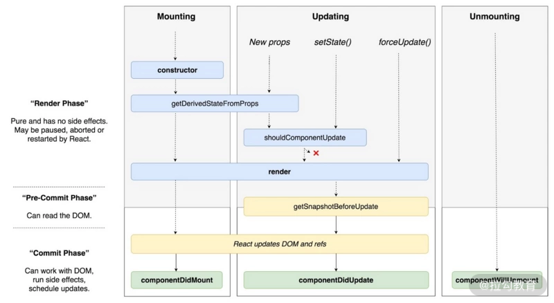

React 组件从创建到销毁的过程被称为组件的生命周期，分为挂载，更新，卸载阶段，我们先来说说 React16 的生命周期

### 挂载

挂载阶段是指组件从初始化到完成加载的过程。

#### 1. constructor

constructor 是类通用的构造函数，常用于初始化。所以**在过去，constructor 通常用于初始化 state 与绑定事件处理函数。**

```javascript
constuctor(props) {
    super(props)
    this.state = {
      count: 0,
    }
    this.handleClick = this.handleClick.bind(this)
}
```

当类属性开始流行之后，React 社区的写法发生了变化，即去除了 constructor。

1. constructor 中并不推荐去处理初始化以外的逻辑；

2. 本身 constructor 并不属于 React 的生命周期，它只是 Class 的初始化函数；
3. 通过移除 constructor，代码也会变得更为简洁。

#### 2. getDerivedStateFromProps

本函数的作用是使组件在 props 变化时更新 state。

16.3 版本时，只有 props 改变时触发，16.4 版本后，setState, forceupdate 也会触发。
只要父级组件重新渲染时，getDerivedStateFromProps 就会被调用。

```javascript
static getDerivedStateFromProps(newProps, prevState) {
    if (newProps.currentRow !== prevState.lastRow) {
      return {
        isScrollingDown: newProps.currentRow > prevState.lastRow,
        lastRow: newProps.currentRow,
      };
    }

    // 返回 null 表示无需更新 state。
    return null;
  }
```

#### 3. UNSAFE_componentWillMount(废弃)

也就是 componentWillMount，本来用于组件即将加载前做某些操作，但目前被标记为弃用。因为在 React 的异步渲染机制下，该方法可能会被多次调用。

一个常见的错误是 componentWillMount 跟**服务器端同构渲染**的时候，如果在该函数里面发起网络请求，拉取数据，那么会在**服务器端与客户端分别执行一次**。所以更推荐在 componentDidMount 中完成数据拉取操作。

#### 4. render

render 函数返回的 JSX 结构，用于描述具体的渲染内容。但切记，**render 函数并没有真正的去渲染组件，渲染是依靠 React 操作 JSX 描述结构来完成的**。还有一点需要注意，**render 函数应该是一个纯函数，不应该在里面产生副作用，比如调用 setState 或者绑定事件**。

那为什么不能 setState 呢？因为 render 函数在每次渲染时都会被调用，而 setState 会触发渲染，就会造成死循环。

那又为什么不能绑定事件呢？因为容易被频繁调用注册。

#### 5. componentDidMount

componentDidMount 主要用于组件加载完成时做某些操作，比如发起网络请求或者绑定事件，该函数是接着 render 之后调用的。依赖 Dom 节点的操作可以放到这个方法中，通常用于向服务器端请求数据。

### 更新

更新阶段是指外部 props / state 发生变化时的阶段。该阶段我们着重介绍下以下 6 个函数：

#### 1. UNSAFE_componentWillReceiveProps(废弃)

该函数已被标记弃用，因为其功能可被函数 getDerivedStateFromProps 所替代。

另外，当 getDerivedStateFromProps 存在时，UNSAFE_componentWillReceiveProps 不会被调用。

componentWillReceiveProps 并不是由 props 的变化触发的，而是由父组件的更新触发的，如果父组件导致组件重新渲染，即使 props 没有更改，也会调用此方法

#### 2. getDerivedStateFromProps

同挂载阶段的表现一致。
getDerivedStateFromProps 不能完全和 componentWillReceiveProps 画等号，其特性决定了我们曾经在 componentWillReceiveProps 里面做的事情，不能够百分百迁移到 getDerivedStateFromProps 里。

从 getDerivedStateFromProps 直接被定义为 static 方法这件事上就可见一斑—— static 方法内部拿不到组件实例的 this，这就导致你无法在 getDerivedStateFromProps 里面做任何类似于 this.fetch()、不合理的 this.setState（会导致死循环的那种）这类可能会产生副作用的操作。

因此，getDerivedStateFromProps 生命周期替代 componentWillReceiveProps 的背后，是 React 16 在强制推行“只用 getDerivedStateFromProps 来完成 props 到 state 的映射”这一最佳实践。意在确保生命周期函数的行为更加可控可预测，从根源上帮开发者避免不合理的编程方式，避免生命周期的滥用；同时，也是在为新的 Fiber 架构铺路。

#### 3. shouldComponentUpdate

该方法通过返回 true 或者 false 来确定是否需要触发新的渲染。因为渲染触发最后一道关卡，所以也是性能优化的必争之地。通过添加判断条件来阻止不必要的渲染。

React 官方提供了一个通用的优化方案，也就是 PureComponent。PureComponent 的核心原理就是默认实现了 shouldComponentUpdate 函数，在这个函数中对 props 和 state 进行浅比较，用来判断是否触发更新。

#### 4. UNSAFE_componentWillUpdate(废弃)

同样已废弃，因为后续的 React 异步渲染设计中，可能会出现组件暂停更新渲染的情况。

#### 5. render

同挂载阶段一致

#### 6.getSnapshotBeforeUpdate

getSnapshotBeforeUpdate 方法是配合 React 新的异步渲染的机制，**它的执行时机是在 render 方法之后，真实 DOM 更新之前。**在这个阶段里，我们可以同时获取到更新前的真实 DOM 和更新前后的 state&props 信息。

#### 7.componentDidUpdate

正如上面的案例，getSnapshotBeforeUpdate 的返回值会作为 componentDidUpdate 的第三个参数使用。

componentDidUpdate 中可以使用 setState，会触发重渲染，但一定要小心使用，避免死循环。

### 卸载

componentWillUnmount

该函数主要用于执行清理工作。一个比较常见的 Bug 就是忘记在 componentWillUnmount 中取消定时器，导致定时操作依然在组件销毁后不停地执行。所以一定要在该阶段解除事件绑定，取消定时器。

#### React 15 生命周期

#### 挂载

constructor
componentWillMount
render
componentDidMount

#### 更新

componentWillReceiveProps
shouldComponentUpdate
compoentWillUpdate
render
componentDidUpdate

#### 卸载

componentWillUnmount

### 为什么要改变生命周期

Fiber 架构的重要特征就是可以被打断的异步渲染模式。但这个“打断”是有原则的，根据“能否被打断”这一标准，React 16 的生命周期被划分为了 render 和 commit 两个阶段，而 commit 阶段又被细分为了 pre-commit 和 commit。每个阶段所涵盖的生命周期如下图所示：



我们先来看下三个阶段各自有哪些特征（以下特征翻译自上图）。

- render 阶段：纯净且没有副作用，可能会被 React 暂停、终止或重新启动。

- pre-commit 阶段：可以读取 DOM。

- commit 阶段：可以使用 DOM，运行副作用，安排更新。

总的来说，render 阶段在执行过程中允许被打断，而 commit 阶段则总是同步执行的。

为什么这样设计呢？简单来说，由于 render 阶段的操作对用户来说其实是“不可见”的，所以就算打断再重启，对用户来说也是零感知。而 commit 阶段的操作则涉及真实 DOM 的渲染，再狂的框架也不敢在用户眼皮子底下胡乱更改视图，所以这个过程必须用同步渲染来求稳。

细说生命周期“废旧立新”背后的思考
在 Fiber 机制下，render 阶段是允许暂停、终止和重启的。当一个任务执行到一半被打断后，下一次渲染线程抢回主动权时，这个任务被重启的形式是“**重复执行一遍整个任务”而非“接着上次执行到的那行代码往下走**”。这就导致 render 阶段的生命周期都是有可能被重复执行的。

带着这个结论，我们再来看看 React 16 打算废弃的是哪些生命周期：

- componentWillMount；

- componentWillUpdate；

- componentWillReceiveProps。

这些生命周期的共性，就是它们都处于 render 阶段，都可能重复被执行，而且由于这些 API 常年被滥用，它们在重复执行的过程中都存在着不可小觑的风险。

以下一些开发人员的习惯操作：

- setState()；

- fetch 发起异步请求；

- 操作真实 DOM。

这些操作的问题（或不必要性）包括但不限于以下 3 点：

##### 1. 完全可以转移到其他生命周期（尤其是 componentDidxxx）里去做。

比如在 componentWillMount 里发起异步请求。很多同学因为太年轻，以为这样做就可以让异步请求回来得“早一点”，从而避免首次渲染白屏。

可惜你忘了，异步请求再怎么快也快不过（React 15 下）同步的生命周期。componentWillMount 结束后，render 会迅速地被触发，所以说首次渲染依然会在数据返回之前执行。这样做不仅没有达到你预想的目的，还会导致服务端渲染场景下的冗余请求等额外问题，得不偿失。

##### 2. 在 Fiber 带来的异步渲染机制下，可能会导致非常严重的 Bug。

试想，假如你在 componentWillxxx 里发起了一个付款请求。由于 render 阶段里的生命周期都可以重复执行，在 componentWillxxx 被打断 + 重启多次后，就会发出多个付款请求。

结合上面的分析，我们再去思考 getDerivedStateFromProps 为何会在设计层面直接被约束为一个触碰不到 this 的静态方法，其背后的原因也就更加充分了——避免开发者触碰 this，就是在避免各种危险的骚操作。

##### 3.即使你没有开启异步，React 15 下也有不少人能把自己“玩死”。

比如在 componentWillReceiveProps   和 componentWillUpdate 里滥用 setState 导致重复渲染死循环的。

**总的来说，React 16 改造生命周期的主要动机是为了配合 Fiber 架构带来的异步渲染机制**。确保了 Fiber 机制下数据和视图的安全性，同时也确保了生命周期方法的行为更加纯粹、可控、可预测。

### 参考链接

1. [如何避免生命周期中的坑？](https://kaiwu.lagou.com/course/courseInfo.htm?courseId=566#/detail/pc?id=5793)
2. [为什么 React 16 要更改组件的生命周期？（下）](https://kaiwu.lagou.com/course/courseInfo.htm?courseId=510#/detail/pc?id=4852)

3. 管理后台分时报表优化以及公告管理上线

4. 报表模板在线编辑工具开发：

   1. 集成 x-data-spreadsheet 插件，封装基础表格组件 2. 支持中文：修改 x-data-spreadsheet 源码 local.js 3. 支持单元格不自动计算表达式值：修改源码，通过 data.settings.ignoreFormula 控制是否计算表达式

   2. 包装基础表格组件，实现复杂编辑功能，支持公式编辑，高亮显示变量。

   3. 抽离 excel 导入函数
