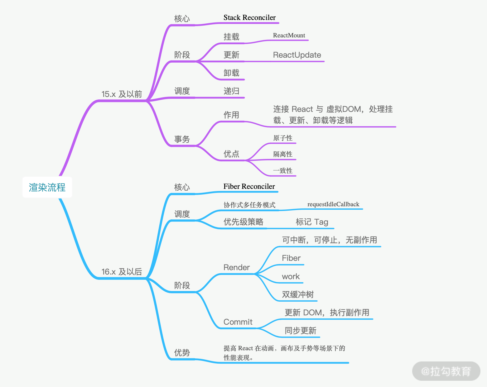

框架：

1. 核心
2. 阶段
3. 调度
4. 事务

### 协调 Reconciler

狭义上说，Reconciler 是协助 React 确认状态变化时要更新哪些 DOM 元素的 diff 算法。

而在 React 源码中还有一个叫作 **reconcilers** 的模块，它通过**抽离公共函数与 diff 算法**使声明式渲染、自定义组件、state、生命周期方法和 refs 等特性实现**跨平台**工作。

Reconciler 模块以 React 16 为分界线分为两个版本。

Stack Reconciler 是 React 15 及以前版本的渲染方案，其核心是以**递归**的方式逐级调度栈中子节点到父节点的渲染。

Fiber Reconciler 是 React 16 及以后版本的渲染方案，它的核心设计是**增量渲染**（incremental rendering），也就是将渲染工作分割为多个区块，并将其分散到多个帧中去执行。它的设计初衷是提高 React 在动画、画布及手势等场景下的性能表现。

### 挂载

这里的挂载与生命周期一讲中的挂载不同，它是将整个 React 挂载到 ReactDOM.render 之上，就像 App 组件挂载到 root 节点上一样。
ReactDOM.render(React.creatElement(App), document.getElementById('root'))
但一定要记住，**这项工作发生在本地的 Node 进程中，而不是通过浏览器中的 React 完成的。** 在以往的面试中，就有应聘的同学以为 JSX 是通过 React 完成编译，这是完全不正确的。

ReactDOM.render 调用之后，实际上是透传参数给 ReactMount.render。

ReactDOM 是对外暴露的模块接口；

而 ReactMount 是实际执行者，完成初始化 React 组件的整个过程。

**初始化第一步就是通过 React.creatElement 创建 React Element**。不同的组件类型会被构建为不同的 Element：

- App 组件会被标记为 type function，作为**用户自定义的组件，被 ReactComponentsiteComponent 包裹一次，生成一个对象实例**；

- div 标签作为 **React 内部的已知 DOM 类型，会实例化为 ReactDOMComponent**；

- "Hello World" 会被直接判断是否为字符串，实例化为 ReactDOMComponent。

到这里仅仅完成了实例化，我们还需要与 React 产生一些联动，比如改变状态、更新界面等，涉及一个**变更收集再批量处理的**过程，在这里 **ReactUpdates 模块就专门用于批量处理**，而批量处理的前后操作，是由 **React 通过建立事务**的概念来处理的。

#### 事务

React 事务都是基于 Transaction 类继承拓展。每个 Transaction 实例都是一个封闭空间，保持不可变的任务常量，并提供对应的事务处理接口 。

- 原子性: 事务作为一个整体被执行，要么全部被执行，要么都不执行。
- 隔离性: 多个事务并发执行时，一个事务的执行不应影响其他事务的执行。
- 一致性: 相同的输入，确定能得到同样的执行结果。

上面提到的事务会调用 ReactCompositeComponent.mountComponent 函数进入 React 组件生命周期，它的源码大致是这样的。

```javascript
if (inst.componentWillMount) {
  inst.componentWillMount();
  if (this._pendingStateQueue) {
    inst.state = this._processPendingState(inst.props, inst.context);
  }
}
```

1. 首先会判断是否有 **componentWillMount**，然后初始化 state 状态。
2. 当 state 计算完毕后，就会调用在 App 组件中声明的 **render** 函数。
3. 接着 render 返回的结果，会处理为新的 React Element，再走一遍上面提到的流程，不停地往下解析，**逐步递归**，直到开始处理 HTML 元素。到这里我们的 App 组件就完成了首次渲染。

### 更新

```javascript
ReactComponent.prototype.setState = function (partialState, callback) {
  this.updater.enqueueSetState(this, partialState);

  if (callback) {
    this.updater.enqueueCallback(this, callback, "setState");
  }
};

function enqueueSetState(publicInstance, partialState) {
  // 根据 this 拿到对应的组件实例

  var internalInstance = getInternalInstanceReadyForUpdate(
    publicInstance,
    "setState"
  );

  // 这个 queue 对应的就是一个组件实例的 state 数组

  var queue =
    internalInstance._pendingStateQueue ||
    (internalInstance._pendingStateQueue = []);

  queue.push(partialState);

  //  enqueueUpdate 用来处理当前的组件实例

  enqueueUpdate(internalInstance);
}

function enqueueUpdate(component) {
  ensureInjected();

  // 注意这一句是问题的关键，isBatchingUpdates标识着当前是否处于批量创建/更新组件的阶段

  if (!batchingStrategy.isBatchingUpdates) {
    // 若当前没有处于批量创建/更新组件的阶段，则立即更新组件

    batchingStrategy.batchedUpdates(enqueueUpdate, component);

    return;
  }

  // 否则，先把组件塞入 dirtyComponents 队列里，让它“再等等”

  dirtyComponents.push(component);

  if (component._updateBatchNumber == null) {
    component._updateBatchNumber = updateBatchNumber + 1;
  }
}
/**

 * batchingStrategy源码

**/

var ReactDefaultBatchingStrategy = {
  // 全局唯一的锁标识

  isBatchingUpdates: false,

  // 发起更新动作的方法

  batchedUpdates: function (callback, a, b, c, d, e) {
    // 缓存锁变量

    var alreadyBatchingStrategy =
      ReactDefaultBatchingStrategy.isBatchingUpdates;

    // 把锁“锁上”

    ReactDefaultBatchingStrategy.isBatchingUpdates = true;

    if (alreadyBatchingStrategy) {
      callback(a, b, c, d, e);
    } else {
      // 启动事务，将 callback 放进事务里执行

      transaction.perform(callback, null, a, b, c, d, e);
    }
  },
};
```

1. setState 会调用 this.updater.enqueueSetState 方法
2. enqueueSetState 做了两件事：

- 将新的 state 放进组件的状态队列里；
- 用 enqueueUpdate 来处理将要更新的实例对象

3. enqueueUpdate **检查 isBatchingUpdates 判断当前是否处于批量创建/更新组件的阶段**，isBatchingUpdates 相当于全局的更新锁，直接决定了当下是要走更新流程，还是应该排队等待

- isBatchingUpdates 为 true， 把组件加入 dirtyComponents 列表；
- isBatchingUpdates 为 false，则调用 batchingStrategy.batchedUpdates()立即更新组件

4. 调用 batchedUpdate 去执行更新动作时，isBatchingUpdates 置为 true，表明“现在正处于批量更新过程中”，任何需要更新的组件都只能暂时进入 dirtyComponents 里排队等候下一次的批量更新。

### 卸载

**对于自定义组件，也就是对 ReactCompositeComponent 而言，卸载过程需要递归地调用生命周期函数。**

```javascript
class CompositeComponent {
  unmount() {
    var publicInstance = this.publicInstance;
    if (publicInstance) {
      if (publicInstance.componentWillUnmount) {
        publicInstance.componentWillUnmount();
      }
    }
    var renderedComponent = this.renderedComponent;
    renderedComponent.unmount();
  }
}
```

**而对于 ReactDOMComponent 而言，卸载子元素需要清除事件监听器并清理一些缓存。**

```javascript
class DOMComponent {
  unmount() {
    var renderedChildren = this.renderedChildren;
    renderedChildren.forEach((child) => child.unmount());
  }
}
```

### 小结

从以上的流程中我们可以看出，React 渲染的整体策略是递归，并通过事务建立 React 与虚拟 DOM 的联系并完成调度

### Fiber Reconciler

为了避免全文过于冗长，也因为主要流程大致相同，所以我就不再赘述与 Stack Reconciler 相似的地方，主要讲一讲不一样的地方。那第一个不同点是，Stack 和 Fiber 的不同。Stack 是栈，那 Fiber 是什么呢？我们需要先理解什么是 Fiber。

### Fiber

Fiber 同样是一个借来的概念，在系统开发中，指一种最轻量化的线程。与一般线程不同的是，Fiber 对于系统内核是不可见的，也不能由内核进行调度。它的运行模式被称为协作式多任务，而线程采用的模式是抢占式多任务。

- 在协作式多任务模式下，线程会定时放弃自己的运行权利，告知内核让下一个线程运行；

- 而在抢占式下，**内核决定调度方案**，可以直接剥夺长耗时线程的时间片，提供给其他线程。

回到浏览器中，**浏览器无法实现抢占式调度**，那为了提升可用性与流畅度，**React 在设计上只能采用合作式调度的方案：将渲染任务拆分成多段，每次只执行一段，完成后就把时间控制权交还给主线程，这就是得名 Fiber Reconciler 的原因**。

在 Fiber Reconciler 还引入了两个新的概念，分别是 Fiber 与 effect。

- 在 React Element 的基础上，通过 createFiberFromElement 函数创建 Fiber 对象。Fiber 不仅包含 React Element，还包含了指向父、子、兄弟节点的属性，保证 Fiber 构成的虚拟 DOM 树成为一个**双向链表**。

- effect 是指在协调过程中必须执行计算的活动。

### 协调


Render

Render 阶段主要是**通过构造 workInProgress 树计算出 diff**。以 current 树为基础，将每个 Fiber 作为一个基本单位，自下而上逐个节点检查并构造 workInProgress 树。**这个过程不再是递归，而是基于循环来完成**。

在执行上通过 **requestIdleCallback** 来调度执行每组任务，每组中的每个计算任务被称为 work，调度任务通过标记 tag 的方式分优先级执行。每个 work 完成后确认是否有优先级更高的 work 需要插入，如果有就让位，没有就继续。优先级通常标记为动画或者 high 的会先处理。每完成一组后，将调度权交回主线程，直到下一次 requestIdleCallback 调用，再继续构建 workInProgress 树。

### Commit

在 Commit 阶段**处理 effect 列表**，这里的 effect 列表包含了根据 diff 更新 DOM 树、回调生命周期、响应 ref 等。

但一定要注意，这个阶段是**同步执行的，不可中断暂停**，所以不要在 componentDidMount、componentDidUpdate、componentWiilUnmount 中执行重度消耗算力的任务。

### 小结

在上面的讲述中，省去了挂载与更新流程，这里稍微补充下，**在挂载阶段， ReactMount 模块已经不存在了，是直接构造 Fiber 树。而更新流程大致一样，依然通过 IsBatchingUpdates 控制** 。那么 Fiber Reconciler 最大的不同有两点：

1. 协作式多任务模式；
2. 基于循环遍历计算 diff。

总结：

