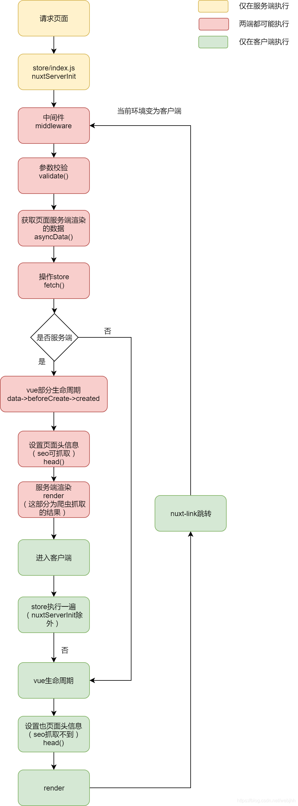

https://blog.csdn.net/weixin_44523860/article/details/108949531
https://juejin.cn/post/6844903833840123912

## SSR

### SPA

单页 Web 应用，就是只有一张 Web 页面的应用，与后台仅仅是数据的交互，不会再请求其它页面。浏览器一开始会加载必需的 HTML、CSS 和 JavaScript，所有的操作都在这张页面上完成，都由 JavaScript 来控制。

SPA 虽然给服务器减轻了压力，但是也是有缺点的：

1. 首屏渲染时间比较长：必须等待 JavaScript 加载完毕，并且执行完毕，才能渲染出首屏。
2. SEO 不友好：爬虫只能拿到一个 div 元素，认为页面是空的，不利于 SEO。

为了解决如上两个问题，出现了 SSR 解决方案，后端渲染出首屏的 DOM 结构返回，前端拿到内容带上首屏，后续的页面操作，再用单页面路由和渲染，称之为服务端渲染(SSR)

### SSR

SSR 渲染流程是这样的，客户端发送 URL 请求到服务端，服务端读取对应的 url 的模板信息，在服务端做出 html 和数据的渲染，渲染完成之后返回 html 结构，客户端这时拿到的之后首屏页面的 html 结构。所以用户在浏览首屏的时候速度会很快，因为客户端不需要再次发送 ajax 请求。并不是做了 SSR 我们的页面就不属于 SPA 应用了，它仍然是一个独立的 spa 应用。
SSR 是处于 CSR 与 SPA 应用之间的一个折中的方案，在渲染首屏的时候在服务端做出了渲染，**注意仅仅是首屏，其他页面还是需要在客户端渲染的，在服务端接收到请求之后并且渲染出首屏页面，会携带着剩余的路由信息预留给客户端去渲染其他路由的页面。**

Nuxt.js 是使用 Webpack 和 Node.js 进行封装的基于 Vue 的 SSR 框架，使用它，你可以不需要自己搭建一套 SSR 程序，而是通过其约定好的文件结构和 API 就可以实现一个首屏渲染的 Web 应用。

## 配置：

1. build：自定义 webpack 的构建配置

```js
module.exports = {
  build: {
    analyze: true // 开启 webpack-bundle-analyzer 分析并可视化构建后的打包文件， or 通过 nuxt build --analyze 或 nuxt build -a 命令来启用该分析器
    // or
    analyze: {
      analyzerMode: 'static'
    }
  }
}
```

## 生命周期



1. nuxtServerInit 服务端初始化 **只在服务端渲染**
2. middleware 中间件运行 **两端都可能执行**
   middleware 的执行顺序：nuxt.config.js 中配置的 -> 匹配 layouts -> 匹配 pages
3. validate 校验参数 **两端都可能执行**
4. asyncData/fetch 异步数据处理 **两端都可能执行**
   **2.12 后，fetch 在 created 之后执行**
5. render() **两端都可能执行**
6. beforeCreate , created **两端都可能执行**
7. vue 其他生命周期 **客户端**

## nuxtServerInit 方法

如果在状态树中指定了 nuxtServerInit 方法，Nuxt.js 调用它的时候会将页面的上下文对象作为第 2 个参数传给它。当我们想**将服务端的一些数据传到客户端**时，这个方法是灰常好用的。

举个例子，假设我们服务端的会话状态树里可以通过 req.session.user 来访问当前登录的用户。将该登录用户信息传给客户端的状态树，我们只需更新 store/index.js 如下：

```js
actions: {
  nuxtServerInit ({ commit }, { req }) {
    if (req.session.user) {
      commit('user', req.session.user)
    }
  }
}
```

如果你使用状态树模块化的模式，只有主模块（即 store/index.js）适用设置该方法（其他模块设置了也不会被调用）。

## asyncData fetch 的区别

> asyncData **可以用来在客户端加载 Data 数据之前对其做一些处理**，也可以在此发起异步请求，提前设置数据，这样在客户端加载页面的时候，就会直接加载提前渲染好并带有数据的 DOM，完成服务端渲染，有助于搜索引擎的抓取

**旧版本的 fetch 在组件实例化之前运行，无法使用 this**，如同 asyncData，提供了可查询上下文的参数，且亦只能在页面级组件中使用，并且只能通过上下文参数操作 store 状态的数据，而不能设置或合并 data 数据

注：由于 fetch 钩子的功能在 nuxt v2.12 以上版本作了较大调整，所以下文只记录新的使用方式。

> fetch 用来在组件加载时预先提取数据，运行于组件实例创建之后(created)页面渲染完成之前(mounted)，并且可以用于任何组件(包括路由页面或自定义组件)和随时通过$fetch 方法主动更新数据。

1. 执行时机
   1. asyncData:在路由阶段，没有获取状态的方法
   2. fetch:在 created 之后，可以通过$fetchState 获取 fetch 状态
2. 范围不同
   1. asyncData:**只有页面组件可用**
   2. fetch:页面组件和普通组件都可用
3. 获取上下文
   1. asyncData **不可以使用 this**，只能通过回调参数获取上下文对象。
   2. fetch 可以使用 this。
4. 数据操作
   1. asyncData 通过 return 合并 data 数据。
   2. fetch 可以使用 this 直接修改赋值。
5. 错误处理
   1. asyncData 通过 error() 参数抛出错误，但并不会在页面显示异常。
   2. fetch 可以使用 throw new Error()来抛出异常，在页面调用$fetchState.error 方法获取异常状态。
6. 页面渲染
   1. asyncData 在页面创建前填充数据。
   2. fetch 可通过 fetchOnServer 属性设置是否允许在服务端获取数据，设置为 false 将可以在渲染数据时通过$fetchState.pendinding 获取加载状态。

### context 上下文对象

属性 类型 可用 描述

1. app vue 根实例 客户端 & 服务端 包含所有插件的根实例。例如:想使用 axios，可以通过 context.app.$axios 获取
2. isClient Boolean 客户端 & 服务端 是否来自客户端渲染，废弃，请使用 process.client
3. isServer Boolean 客户端 & 服务端 是否来自服务端渲染，废弃，请使用 process.server
4. isStatic Boolean 客户端 & 服务端 是否通过 nuxt generate
5. isDev Boolean 客户端 & 服务端 是否开发模式，在生产坏境的数据缓存中用到
6. isHMR Boolean 客户端 & 服务端 是否通过模块热替换，仅在客户端以 dev 模式
7. route 路由 客户端 & 服务端 路由实例
8. **store** vuex 数据 客户端 & 服务端 Vuex.sttore 实例
9. **env** Object 客户端 & 服务端 nuxt.config.js 中的环境变量
10. **params** Object 客户端 & 服务端 route.params 的别名
11. **query** Object 客户端 & 服务端 route.query 的别名
12. res http.Reponse 服务端 Node.js API 的 Reponse 对象。如果 nuxt 以中间件形式使用的话，这个对象就根据你所使用的框架（个人理解为页面）而定。nuxt generate 不可用
13. error() Function 客户端 & 服务端 前往错误页面，error(parmas),params 包含 statusCode 和 message 字段
14. nuxtState Object 客户端 nuxt 状态
15. req http.Request 服务端 Node.js API 的 Request 对象。如果 nuxt 以中间件形式使用的话，这个对象就根据你所使用的框架（个人理解为页面）而定。 nuxt generate 不可用
16. beforeNuxtRender（fn） 服务端 更新 NUXT 在客户端呈现的变量,具体了解请看官网
17. redirect Function 服务端 用于重定向另一个路由，状态码在服务端被使用，默认 302 redirect([status,]path[,query])

## Nuxt 的路由配置和参数传递

2. 页面跳转
   不要写成 a 标签，因为是重新获取一个新的页面，并不是 SPA
   <nuxt-link to="/users"></nuxt-link>
   this.$router.push('/users')

3. 动态路由
   在 Nuxt.js 里面定义带参数的动态路由，需要创建对应的以下划线作为前缀的 Vue 文件 或 目录。
   获取动态参数{{$route.params.id}}

4. 路由参数校验

```js
validate(obj) {
    // console.log(obj);
    // return true
    return /^\d+$/.test(obj.params.id)
  }
```

## Nuxt 的路由动画效果

### 全局动画


1. 在全局样式 assets/main.css 中添加以下内容

```css
.page-enter-active,
.page-leave-active {
  transition: opacity 2s;
}

.page-enter,
.page-leave-active {
  opacity: 0;
}
```

#### 单页面

2. 在全局样式 assets/main.css 中添加以下内容

```css
.test-enter-active,
.test-leave-active {
  transition: all 2s;
  font-size: 12px;
}
.test-enter,
.test-leave-active {
  opacity: 0;
  font-size: 40px;
}
```

3. 然后在 about/index.vue 组件中设置
```js
export default {
   transition:'test'
}
```

## 7. Window 或 Document 对象未定义？

背景: 在引入第三方插件，或者直接在代码中写 window 时，控制台会给出警告，window 未定义。

发生在这个问题的原因时，node服务端并没有window 或 document 对象。解决方法，通过 process.browser 来区分环境。
if (process.browser) {
  // 引入第三方插件
  require('***')
  // 或者修改window对象下某一属性
  window.mbk = {}
}

## 如何修改环境变量 NODE_ENV

背景：在项目中，设置 3个 NODE_ENV 的值，来对应不同的版本。development，本地开发；release，预发布版本；production，线上版本。其中，预发布版本比production版本，多出vconsole。

// package.json
"scripts": {
  "buildDev": "cross-env NODE_ENV=release nuxt build && backpack build",
  "startDev": "cross-env NODE_ENV=release PORT=3000 node build/main.js"
  },
复制代码打印 process.env.NODE_ENV 依旧是，production。
在 backpack 的源码中，找到了答案，在 执行 backpack build 命令时，会把 process.env.NODE_ENV 修改为 production，并且是写死的不可配置的......
无奈下，只能在 process.env 下，添加 __ENV 属性，代表 NODE_ENV

这时，在页面中打印出来的信息 process.env.__ENV undefined，但是可以打印出 process.env.NODE_ENV。
可以通过配置 nuxt.config.js 中的，env属性，解决该问题。
env: {
  __ENV: process.env.__ENV
}