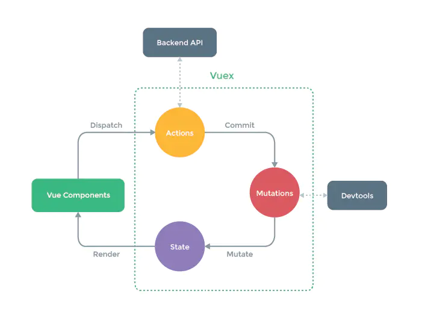

### Vue 子组件和父组件的执行顺序

1. 加载渲染过程

- 父 beforeCreate
- 父 created
- 父 beforeMount
- 子 beforeCreate
- 子 created
- 子 beforeMount
- 子 mounted
- 父 mounted

2. 更新

- 父 beforeUpdate
- 子 beforeUpdate
- 子 updated
- 父 updated

### 简述 Vue 的基本原理

### 说一说你对 vue 响应式理解？

#### 答题思路：

啥是响应式？
为什么 vue 需要响应式？
它能给我们带来什么好处？
vue 的响应式是怎么实现的？有哪些优缺点？
vue3 中的响应式的新变化

#### 回答范例：

1. 所谓数据响应式就是能够使**数据变化可以被检测并对这种变化做出响应**的机制。
2. mvvm 框架中要解决的一个核心问题是连接数据层和视图层，通过数据驱动应用，数据变化，视图更新，要做到这点的就需要对数据做响应式处理，这样一旦数据发生变化就可以立即做出更新处理。
3. 以 vue 为例说明，通过数据响应式加上虚拟 DOM 和 patch 算法，可以使我们只需要操作数据，完全不用接触繁琐的 dom 操作，从而大大提升开发效率，降低开发难度。
4. vue2 中的数据响应式会根据数据类型来做不同处理，如果是对象则采用 Object.defineProperty()的方式定义数据拦截，当数据被访问或发生变化时，我们感知并作出响应；如果是数组则通过覆盖该数组原型的方法，扩展它的 7 个变更方法，使这些方法可以额外的做更新通知，从而作出响应。这种机制很好的解决了数据响应化的问题，但在实际使用中也存在一些缺点：比如初始化时的递归遍历会造成性能损失；新增或删除属性时需要用户使用 Vue.set/delete 这样特殊的 api 才能生效；对于 es6 中新产生的 Map、Set 这些数据结构不支持等问题。
5. 为了解决这些问题，vue3 重新编写了这一部分的实现：利用 ES6 的 Proxy 机制代理要响应化的数据，它有很多好处，编程体验是一致的，不需要使用特殊 api，初始化性能和内存消耗都得到了大幅改善；另外由于响应化的实现代码抽取为独立的 reactivity 包，使得我们可以更灵活的使用它，我们甚至不需要引入 vue 都可以体验。

### Vue2 和 Vue3 中的响应式原理对比，分别的具体实现思路

##### 答题思路：

可以先说 vue2 响应式原理
然后说出它的问题
最后说出 vue3 是怎么解决的

##### 回答范例：

vue2 数据响应式实现根据对象类型做不同处理，如果是 object，则通过 Object.defineProperty(obj,key,descriptor)拦截对象属性访问

```javascript
function defineReactive(obj, key, val) {
  Object.defineProperty(obj, key, {
    get() {
      return val;
    },
    set(v) {
      val = v;
      notify();
    },
  });
}
```

如果是数组，则覆盖数组的 7 个变更方法实现变更通知

```javascript
const arrayProto = Array.prototype;
const arrayMethods = Object.create(arrayProto);

["push", "pop", "shift", "unshift", "splice", "sort", "reverse"].forEach(
  function (method) {
    const original = arrayProto[method];
    def(arrayMethods, method, function mutator(...args) {
      const result = original.apply(this, args);
      notify();
      return result;
    });
  }
);
```

可以看到 vue2 中有几个问题：

1. 初始化时需要遍历对象所有 key，如果对象层级较深，性能不好
2. 通知更新过程需要维护大量 dep 实例和 watcher 实例，额外占用内存较多
3. 动态新增、删除对象属性无法拦截，只能用特定 set/delete api 代替
4. 不支持新的 Map、Set 等数据结构

vue3 中为了解决以上问题，使用原生的 Proxy 代替：

```javascript
function defineReactive(obj) {
  return new Proxy(obj, {
    get(target, key) {
      track(target, key);
      return Reflect.get(target, key);
    },
    set(target, key, val) {
      Reflect.set(target, key, val);
      trigger(target, key);
    },
    deleteProperty(target, key) {
      Reflect.deleteProperty(target, key);
      trigger(target, key);
    },
  });
}
```

可以同时支持 object 和 array，动态属性增、删都可以拦截，新增数据结构均支持，对象嵌套属性运行时递归，用到才代理，也不需要维护特别多的依赖关系，性能取得很大进步。

### Vue 和 React 对比

这里就做几个简单的类比吧，当然没有好坏之分，只是使用场景不同

#### 相同点

1. 都有组件化思想
2. 都支持服务器端渲染
3. 都有 Virtual DOM（虚拟 dom）
4. MVVM 模型
5. 都有支持 native 的方案：Vue 的 weex、React 的 React native
6. 都有自己的构建工具：Vue 的 vue-cli、React 的 Create React App

#### 区别

1.  数据变化的实现原理不同。react 使用的是不可变数据，而 Vue 使用的是可变的数据
2.  组件化通信的不同。react 中我们通过使用回调函数来进行通信的，而 Vue 中子组件向父组件传递消息有两种方式：事件和回调函数
3.  diff 算法不同。react 主要使用 diff 队列保存需要更新哪些 DOM，得到 patch 树，再统一操作批量更新 DOM。Vue 使用双向指针，边对比，边更新 DOM

### v-if 和 v-for 哪个优先级更高？

(补充：3.x 版本中 v-if 总是优先于 v-for 生效。)

##### 思路分析：总分总模式

先给出结论
为什么是这样的
它们能放一起吗
如果不能，那应该怎样
总结

##### 回答范例：

1. v-for 优先于 v-if 被解析

2. 我曾经做过实验，把它们放在一起，输出的渲染函数中可以看出会先执行循环再判断条件

3. 实践中也不应该把它们放一起，因为哪怕我们只渲染列表中一小部分元素，也得在每次重渲染的时候遍历整个列表。

4. 通常有两种情况下导致我们这样做：

   1. 为了过滤列表中的项目 (比如 v-for="user in users" v-if="user.isActive")。此时定义一个计算属性 (比如 activeUsers)，让其返回过滤后的列表即可。

   2. 为了避免渲染本应该被隐藏的列表 (比如 v-for="user in users" v-if="shouldShowUsers")。此时把 v-if 移动至容器元素上 (比如 ul、ol)即可。

### 能说说双向绑定以及它的实现原理吗？
https://segmentfault.com/a/1190000006599500
#### 什么是双向绑定

MVVM 业务逻辑层（ViewModel）：框架封装的核心，它负责将数据与视图关联起来 ，这里的控制层的核心功能便是 “数据双向绑定”，理解 ViewModel
它的主要职责就是：

1. 数据变化后更新视图
2. 视图变化后更新数据
   它的两个重要组成
3. 监听器（Observer）：对所有数据的属性进行监听
4. 解析器（Compiler）：对每个元素节点的指令进行扫描跟解析,根据指令模板替换数据,以及绑定相应的更新函数

#### 双向绑定的好处

使用 v-model 可以减少大量繁琐的事件处理代码，提高开发效率，代码可读性也更好，通常在表单项上使用 v-mode

#### 双向绑定的原理
https://segmentfault.com/a/1190000006599500

要实现 Vue 中的双向绑定，大致可以分为三个模块
Observer, Compile, Watcher
1. 数据监听器 Observer。用来**劫持并监听**所有属性，监听到数据变化后**通知订阅**者。

    消息订阅器Dep, 维护一个数组，用来收集订阅者，数据变动触发dep.notify，再调用订阅者的update方法。

  2. 解析器Compile。是**解析模板**指令，将模板中的变量替换成数据，然后**初始化渲染页面**视图，并将每个指令对应的节点**绑定更新函数update**，**添加监听数据的订阅者**，一旦**数据有变动**，**收到通知，更新视图**。

  3. Watcher订阅者。作为Observer和Compile之间通信的桥梁，主要做的事情是:
    1. 在自身实例化时往属性订阅器(dep)里面添加自己
    2. 自身必须有一个update()方法
    3. 待属性变动dep.notify()通知时，能调用自身的update()方法，并触发Compile中绑定的回调，则功成身退。


#### 可能的追问：

1. v-model 和 sync 修饰符有什么区别
2. 自定义组件使用 v-model 如果想要改变事件名或者属性名应该怎么做

### 你了解 vue 中的 diff 算法吗

https://github.com/febobo/web-interview/issues/24

##### 是什么

diff 算法是一种通过同层的树节点进行比较的高效算法

其有两个特点：

- 比较只会在同层级进行, 不会跨层级比较
- 在 diff 比较的过程中，循环从两边向中间比较

diff 算法的在很多场景下都有应用，在 vue 中，作用于虚拟 dom 渲染成真实 dom 的新旧 VNode 节点比较

##### 比较过程

patch 过程遵循**深度优先、同层比较**的策略。

###### patch 函数

当数据发生改变时，set 方法会调用 Dep.notify 通知所有订阅者 Watcher，订阅者就会调用 patch 给真实的 DOM 打补丁，更新相应的视图

patch 函数前两个参数位为 oldVnode 和 Vnode ，分别代表新的节点和之前的旧节点，主要做了四个判断：

1. 没有新节点，直接触发旧节点的 destory 钩子
2. 没有旧节点，说明是页面刚开始初始化的时候，此时，根本不需要比较了，直接全是新建，所以只调用 createElm
3. 旧节点和新节点自身一样，通过 sameVnode 判断节点是否一样，一样时，直接调用 patchVnode 去处理这两个节点
4. 旧节点和新节点自身不一样，当两个节点不一样的时候，直接创建新节点，删除旧节点

###### patchVnode 函数

patchVnode 主要做了几个判断：

1. 新节点是否是文本节点，如果是，则直接更新 dom 的文本内容为新节点的文本内容
2. 只有新节点有子节点，旧节点没有，那么不用比较了，所有节点都是全新的，所以直接全部新建就好了，新建是指创建出所有新 DOM，并且添加进父节点
3. 只有旧节点有子节点而新节点没有，说明更新后的页面，旧节点全部都不见了，那么要做的，就是把所有的旧节点删除，也就是直接把 DOM 删除。
4. 新节点和旧节点如果都有子节点，则处理比较更新子节点 updateChildren

###### updateChildren 函数

updateChildren 主要做了以下操作：

- 设置新旧 VNode 的头尾指针
- 新旧头尾指针进行比较，循环向中间靠拢，根据情况调用 patchVnode 进行 patch 重复流程、调用 createElem 创建一个新节点，从哈希表寻找 key 一致的 VNode 节点再分情况操作

### 你知道 key 的作用吗？

vue 中 key 值的作用可以分为两种情况来考虑。

1. 第一种情况是 v-if 中使用 key。由于 Vue 会尽可能高效地渲染元素，通常会复用已有元素而不是从头开始渲染。因此当我们使用 v-if 来实现元素切换的时候，如果切换前后含有相同类型的元素，那么这个元素就会被复用。如果是相同的 input 元素，那么切换前后用户的输入不会被清除掉，这样是不符合需求的。因此我们可以通过使用 key 来唯一的标识一个元素，这个情况下，使用 key 的元素不会被复用。这个时候 key 的作用是用来标识一个独立的元素。

2. 第二种情况是 v-for 中使用 key。用 v-for 更新已渲染过的元素列表时，它默认使用“就地复用”的策略。如果数据项的顺序发生了改变，Vue 不会移动 DOM 元素来匹配数据项的顺序， 而是简单复用此处的每个元素。因此通过为每个列表项提供一个 key 值，来以便 Vue 跟踪元素的身份，从而高效的实现复用。这个时候 key 的作用是为了高效的更新渲染虚拟 DOM。

### vue 组件的通信方式

[vue 中 8 种组件通信方式, 值得收藏!](https://segmentfault.com/a/1190000020053344)

#### 思路分析：总分

总述知道的所有方式
按组件关系阐述使用场景

##### 回答范例：

父子组件

1. props
2. $emit/$on
3. $parent / $children
4. ref
5. $attrs / $listeners

兄弟组件

1.  $parent
2.  event
3.  vuex

跨层级关系

1. provide/inject
2. $root
3. eventbus
4. vuex

### 简单说一说你对 vuex 理解？

回答策略：3w1h

首先给 vuex 下一个定义
vuex 解决了哪些问题，解读理念
什么时候我们需要 vuex
你的具体用法
简述原理，提升层级
首先是官网定义：

Vuex 是一个专为 Vue.js 应用程序开发的状态管理模式。它采用集中式存储管理应用的所有组件的状态，并以相应的规则保证状态以一种可预测的方式发生变化。

回答范例：

1. vuex 是 vue 专用的状态管理库。它以全局方式集中管理应用的状态，并且可以保证状态变更的可预测性。
2. vuex 主要解决的问题是**多组件之间状态共享**的问题，利用各种组件通信方式，我们虽然能够做到状态共享，但是往往需要在多个组件之间保持状态的一致性，这种模式很容易出现问题，也会使程序逻辑变得复杂。vuex 通过把组件的共享状态抽取出来，以全局单例模式管理，这样任何组件都能用一致的方式获取和修改状态，响应式的数据也能够保证简洁的单向数据流动，我们的代码将变得更结构化且易维护。
3. vuex 并非必须的，它帮我们管理共享状态，但却带来更多的概念和框架。如果我们不打算开发大型单页应用或者我们的应用并没有大量全局的状态需要维护，完全没有使用 vuex 的必要。一个简单的 store 模式就足够了。反之，Vuex 将会成为自然而然的选择。
4. 我在使用 vuex 过程中有如下理解：首先是对核心概念的理解和运用，将全局状态放入 state 对象中，它本身一棵状态树，组件中使用 store 实例的 state 访问这些状态；然后有配套的 mutation 方法修改这些状态，并且只能用 mutation 修改状态，在组件中调用 commit 方法提交 mutation；如果应用中有异步操作或者复杂逻辑组合，我们需要编写 action，执行结束如果有状态修改仍然需要提交 mutation，组件中调用这些 action 使用 dispatch 方法派发。最后是模块化，通过 modules 选项组织拆分出去的各个子模块，在访问状态时注意添加子模块的名称，如果子模块有设置 namespace，那么在提交 mutation 和派发 action 时还需要额外的命名空间前缀。
5. vuex 在实现单项数据流时需要做到数据的响应式，通过源码的学习发现是**借用了 vue 的数据响应化特性实现的，它会利用 Vue 将 state 作为 data 对其进行响应化处理，从而使得这些状态发生变化时，能够导致组件重新渲染**。

### 为什么要用 Vuex 或者 Redux

Redux/vuex 主要解决的问题是**多组件之间状态共享**的问题，利用各种组件通信方式，我们虽然能够做到状态共享，但是往往需要在多个组件之间保持状态的一致性，这种模式很容易出现问题，也会使程序逻辑变得复杂,代码难以维护。vuex/redux 通过把组件的共享状态抽取出来，以全局单例模式管理，这样任何组件都能用一致的方式获取和修改状态，响应式的数据也能够保证简洁的单向数据流动，我们的代码将变得更结构化且易维护。

### 说一下 Vuex 的原理以及自己的理解

https://www.jianshu.com/p/6e45e6814d1c

核心流程：

1. Vue Components 是我们的 vue 组件，组件会触发（dispatch）一些事件或动作，也就是图中的 Actions；

2. 我们在组件中发出的动作，肯定是想获取或者改变数据的，但是在 vuex 中，数据是集中管理的，我们不能直接去更改数据，所以会把这个动作提交（Commit）到 Mutations 中；

3. 然后 Mutations 就去改变（Mutate）State 中的数据；

4. 当 State 中的数据被改变之后，就会重新渲染（Render）到 Vue Components 中去，组件展示更新后的数据，完成一个流程。

### Redux 和 Vuex 有什么区别，说一下他们的共同思想

##### Redux 和 Vuex 区别

- Vuex 改进了 Redux 中的 Action 和 Reducer 函数，以 mutations 变化函数取代 Reducer，无需 switch，只需在对应的 mutation 函数里改变 state 值就可以
- Vuex 由于 Vue 自动重新渲染的特性，无需订阅重新渲染函数，只要生成新的 state 就可以
- 数据流向

  - vuex 的流向：
    view——>commit——>mutations——>state 变化——>view 变化（同步操作）
    view——>dispatch——>actions——>mutations——>state 变化——>view 变化（异步操作）

  - redux 的流向：
    view——>actions——>reducer——>state 变化——>view 变化（同步异步一样）

通俗理解就是:Vuex 弱化 dispatch，通过 commit 进行 store 状态的一次变更；取消了 action 概念，不必传入特定的 action 形式进行指定变更；弱化 reducer，基于 commit 参数直接对数据进行转变，使得框架更加简易。

###### 共同思想

- 单一的数据源
- 变化可以预测
- 本质上:Redux 和 Vuex 都是对 MVVM 思想的服务，将数据从视图中抽离的一种方案
- 形式上:Vuex 借鉴了 Redux，将 store 作为全局的数据中心，进行数据管理
