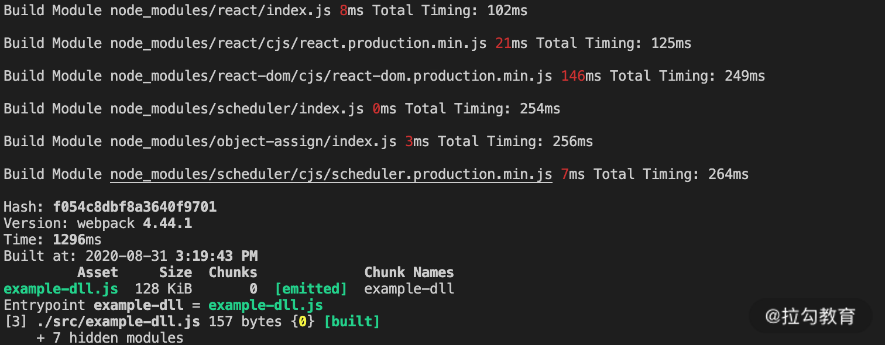
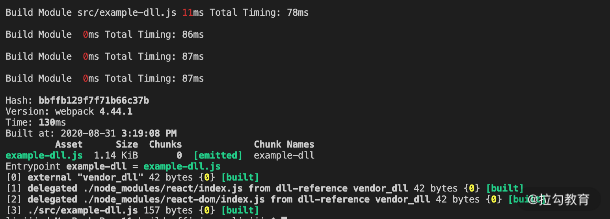

### 在 Compiler 和 Compilation 的工作流程里，最耗时的阶段分别是哪个。

对于 Compiler 实例而言，耗时最长的显然是生成编译过程实例后的 make 阶段，在这个阶段里，会执行模块编译到优化的完整过程。

而对于 Compilation 实例的工作流程来说，不同的项目和配置各有不同，但总体而言，**编译模块和后续优化阶段的生成产物并压缩代码的过程都是比较耗时的**。

不同项目的构建，在整个流程的前期初始化阶段与最后的产物生成阶段的构建时间区别不大。真正影响整个构建效率的还是 Compilation 实例的处理过程，这一过程又可分为两个阶段：编译模块和优化处理。今天我们主要讨论第一个阶段：**编译模块阶段的效率提升。**

### 优化前的准备工作

在进入实际优化分析之前，首先需要进行两项准备工作：

1. **准备基于时间的分析工具**：我们需要一类插件，来帮助我们统计项目构建过程中在编译阶段的耗时情况，这类工具可以是上一课中我们尝试手写的，也可以是使用第三方的工具。例如 speed-measure-webpack-plugin。

2. **准备基于产物内容的分析工具**：从产物内容着手分析是另一个可行的方式，因为从中我们可以找到对产物包体积影响最大的包的构成，从而找到那些冗余的、可以被优化的依赖项。通常，减少这些冗余的依赖包模块，不仅能减小最后的包体积大小，也能提升构建模块时的效率。通常可以使用 webpack-bundle-analyzer 分析产物内容。

在准备好相应的分析工具后，接下来，就开始分析编译阶段的具体提效方向。**编译模块阶段所耗的时间是从单个入口点开始，编译每个模块的时间的总和**。要提升这一阶段的构建效率，大致可以分为三个方向:

1. 减少执行编译的模块。
2. 提升单个模块构建的速度。
3. 并行构建以提升总体效率。

### 1. 减少执行编译的模块。

提升编译模块阶段效率的第一个方向就是减少执行编译的模块。显而易见，如果一个项目每次构建都需要编译 1000 个模块，但是通过分析后发现其中有 500 个不需要编译，显而易见，经过优化后，构建效率可以大幅提升。当然，**前提是找到原本不需要进行构建的模块**，下面我们就来逐一分析。

#### IgnorePlugin

有的依赖包，除了项目所需的模块内容外，还会附带一些多余的模块。典型的例子是 moment 这个包，一般情况下在构建时会自动引入其 locale 目录下的多国语言包

但对于大多数情况而言，项目中只需要引入本国语言包即可。而 Webpack 提供的 IgnorePlugin 即可在构建模块时直接剔除那些需要被排除的模块，从而提升构建模块的速度，并减少产物体积

```js
new webpack.IgnorePlugin({
  resouceRegExp: /^\.\/locale$/,
  contextRegExp: /moment$/,
});
```

除了 moment 包以外，其他一些带有国际化模块的依赖包，例如之前介绍 Mock 工具中提到的 Faker.js 等都可以应用这一优化方式。

#### 按需引入类库模块

这种方式一般适用于工具类库性质的依赖包的优化，典型例子是 lodash 依赖包。通常在项目里我们只用到了少数几个 lodash 的方法，但是构建时却发现构建时引入了整个依赖包

要解决这个问题，效果最佳的方式是**在导入声明时只导入依赖包内的特定模块**，这样就可以大大减少构建时间，以及产物的体积

**除了在导入时声明特定模块之外，还可以使用 babel-plugin-lodash 或 babel-plugin-import 等插件达到同样的效果。**

另外，有同学也许会想到 Tree Shaking，这一特性也能减少产物包的体积，但是这里有两点需要注意：

1. Tree Shaking 需要相应导入的依赖包使用 **ES6 模块化**，而 lodash 还是基于 CommonJS ，需要替换为 lodash-es 才能生效。

2. 相应的操作是在**优化阶段**进行的，换句话说，**Tree Shaking 并不能减少模块编译阶段的构建时间**。

#### DllPlugin

DllPlugin 是另一类减少构建模块的方式，**核心思想是将项目依赖的框架等模块单独构建打包，与普通构建流程区分**，例如：

而在通过 DllPlugin 和 DllReferencePlugin 分别配置后的构建时间就变成如下图所示，由于构建时减少了最耗时的模块，构建效率瞬间提升十倍。


具体 DllPlugin 的用法参考[webpack 使用-详解 DllPlugin](/https://segmentfault.com/a/1190000016567986)

#### externals

Webpack 配置中的 externals 和 DllPlugin 解决的是同一类问题：**将依赖的框架等模块从构建过程中移除**。它们的区别在于：

1. 在 Webpack 的配置方面，externals 更简单，而 DllPlugin 需要独立的配置文件。

2. DllPlugin 包含了依赖包的独立构建流程，而 externals 配置中不包含依赖框架的生成方式，通常使用已传入 CDN 的依赖包。

3. externals 配置的依赖包需要单独指定依赖模块的加载方式：全局对象、CommonJS、AMD 等。

4. 在引用依赖包的子模块时，DllPlugin 无须更改，而 externals 则会将子模块打入项目包中。

### 2. 提升单个模块构建的速度。

提升编译阶段效率的第二个方向，是在保持构建模块数量不变的情况下，提升单个模块构建的速度。具体来说，是通过减少构建单个模块时的一些处理逻辑来提升速度。这个方向的优化主要有以下几种：

#### include/exclude

Webpack 加载器配置中的 include/exclude，是常用的优化特定模块构建速度的方式之一。

include 的用途是**只对符合条件的模块使用指定 Loader 进行转换处理**。而 exclude 则相反，不对特定条件的模块使用该 Loader（例如不使用 babel-loader 处理 node_modules 中的模块）

在一个 loader 中的 include 与 exclude 配置存在冲突的情况下，优先使用 exclude 的配置，而忽略冲突的 include 部分的配置，具体可以参照示例代码中的 webpack.inexclude.config.js。

通过 include/exclude 排除的模块，并非不进行编译，而是使用 Webpack 默认的 js 模块编译器进行编译（例如推断依赖包的模块类型，加上装饰代码等）。

#### noParse

Webpack 配置中的 module.noParse 则是在上述 include/exclude 的基础上，**进一步省略了使用默认 js 模块编译器进行编译的时间**

#### Source Map

Source Map 对于构建时间的影响在第三课中已经展开讨论过，这里再稍做总结：对于生产环境的代码构建而言，会根据项目实际情况判断是否开启 Source Map。在开启 Source Map 的情况下，优先选择与源文件分离的类型，例如 "source-map"。有条件也可以配合错误监控系统，将 Source Map 的构建和使用在线下监控后台中进行，以提升普通构建部署流程的速度。

#### TypeScript 编译优化

Webpack 中编译 TS 有两种方式：使用 ts-loader 或使用 babel-loader。其中，在使用 **ts-loader 时，由于 ts-loader 默认在编译前进行类型检查，因此编译时间往往比较慢**，

通过加上配置项 **transpileOnly: true，可以在编译时忽略类型检查**，从而大大提升 TS 模块的编译速度

而 babel-loader 则需要单独安装 **@babel/preset-typescript**来支持编译 TS（Babel 7 之前的版本则还是需要使用 ts-loader）。babel-loader 的编译效率与上述 ts-loader 优化后的效率相当

不过单独使用这一功能就**丧失了 TS 中重要的类型检查功能**，因此在许多脚手架中往往配合 ForkTsCheckerWebpackPlugin 一同使用。

#### Resolve

Webpack 中的 resolve 配置制定的是在构建时指定查找模块文件的规则，例如：

- resolve.modules：指定查找模块的目录范围。

- resolve.extensions：指定查找模块的文件类型范围。

- resolve.mainFields：指定查找模块的 package.json 中主文件的属性名。

- resolve.symlinks：指定在查找模块时是否处理软连接。

这些规则在处理每个模块时都会有所应用，因此尽管对小型项目的构建速度来说影响不大，但对于大型的模块众多的项目而言，这些配置的变化就可能产生客观的构建时长区别。

### 3. 并行构建以提升总体效率。

第三个编译阶段提效的方向是使用并行的方式来提升构建的效率。并行构建的方案早在 Webpack 2 时代已经出现，随着目前最新稳定版本 Webpack 4 的发布，人们发现在一般项目的开发阶段和小型项目的各构建流程中已经用不到这种并发的思路了，因为在这些情况下，**并发所需要的多进程管理与通信所带来的额外时间成本可能会超过使用工具带来的收益**。但是在大中型项目的生产环境构建时，这类工具仍有发挥作用的空间。这里我们介绍两类并行构建的工具： HappyPack (webpack5 已弃用)与 thread-loader，以及 parallel-webpack。

#### HappyPack 与 thread-loader

这两种工具的本质作用相同，**都作用于模块编译的 Loader 上，用于在特定 Loader 的编译过程中，以开启多进程的方式加速编译**。HappyPack 诞生较早，而 thread-loader 参照它的效果实现了更符合 Webpack 中 Loader 的编写方式

#### parallel-webpack

并发构建的第二种场景是针对与多配置构建。**Webpack 的配置文件可以是一个包含多个子配置对象的数组，在执行这类多配置构建时，默认串行执行，而通过 parallel-webpack，就能实现相关配置的并行处理。**

### 4. 利用缓存可以大幅提升重复构建的速度

## -------分割线----- https://juejin.cn/post/7023242274876162084#heading-22

### 1. 优化构建速度

1. 构建速度分析工具 speed-measure-webpack-plugin
2. 优化 resolve 配置

   1. modules
      告诉 webpack 解析模块时应该搜索的目录,告诉 webpack 优先 src 目录下查找需要解析的文件，会大大节省查找时间

   ```js
   resolve: {
     modules: [resolve('src'), 'node_modules'],
     }
   ```

3. alias
4. externals
   Webpack 配置中的 externals 和 DllPlugin 解决的是同一类问题：**将依赖的框架等模块从构建过程中移除**。它们的区别在于：
5. exclude / include 缩小范围
   在配置 loader 的时候，我们需要更精确的去指定 loader 的作用目录或者需要排除的目录，通过使用 include 和 exclude 两个配置项
6. noParse 一般使用.min.js 结尾的文件，都是已经经过模块化处理的，那么这个时候就没必要在进行 loder 或者 webpack 分析了，noParer 的字面意思也是不再解析。( noParse 该引入还是会引入，只是不参与 loader 或 webpack 的解析及打包。)比如 jquery
7. IgnorePlugin 直接就将符合匹配条件的模块，不再进行引入，代码中没有。比如 moment 中的非中文语言包
8. 多进程 thread-loader
   > 实际上在小型项目中，开启多进程打包反而会增加时间成本，因为启动进程和进程间通信都会有一定开销。
   1. thread-loader
   2. HappyPack webpack5 中已经弃用
9. 缓存 利用缓存可以大幅提升重复构建的速度

   1. 为 babel-loader 开启缓存

   ```js
   const config = {
     module: {
       noParse: /jquery|lodash/,
       rules: [
         {
           test: /\.js$/i,
           include: resolve("src"),
           exclude: /node_modules/,
           use: [
             // ...
             {
               loader: "babel-loader",
               options: {
                 cacheDirectory: true, // 启用缓存
               },
             },
           ],
         },
         {
           test: /\.(s[ac]|c)ss$/i, //匹配所有的 sass/scss/css 文件
           use: [
             // 'style-loader',
             MiniCssExtractPlugin.loader,
             "cache-loader", // 获取前面 loader 转换的结果
             "css-loader",
             "postcss-loader",
             "sass-loader",
           ],
         },
         // ...
       ],
     },
   };
   ```

   2. cache-loader 缓存一些性能开销比较大的 loader 的处理结果
   3. hard-source-webpack-plugin 为模块提供了中间缓存，重复构建时间大约可以减少 80%，但是在**webpack5 中已经内置了模块缓存，不需要再使用此插件**

### 2. 优化构建结果

1. 分析工具 webpack-bundle-analyzer
   借助插件 webpack-bundle-analyzer 我们可以直观的看到打包结果中，文件的体积大小、各模块依赖关系、文件是够重复等问题，极大的方便我们在进行项目优化的时候，进行问题诊断
2. 压缩 CSS
   1. optimize-css-assets-webpack-plugin
   2. OptimizeCSSNanoPlugin
   3. CSSMinimizerWebpackPlugin

这三个插件在压缩 CSS 代码功能方面，**都默认基于 cssnano 实现**，因此在压缩质量方面没有什么差别

```js
optimization: {
 minimize: true,
 minimizer: [
   // 添加 css 压缩配置
   new OptimizeCssAssetsPlugin({}),
 ]
},

```

1. 压缩 js terser-webpack-plugin

```js
optimization: {
    minimize: true, // 开启最小化
    minimizer: [
      // ...
      new TerserPlugin({})
    ]
  },
```

4. 清除无用的 CSS
   purgecss-webpack-plugin 会单独提取 CSS 并清除用不到的 CSS

5. treeShaking Tree-shaking 作用是剔除没有使用的代码，以降低包的体积
   webpack 默认支持，需要在 .bablerc 里面设置 model：false，即可在生产环境下默认开启

6. Scope Hoisting
   Scope Hoisting 即作用域提升，原理是将多个模块放在同一个作用域下，并重命名防止命名冲突，通过这种方式可以减少函数声明和内存开销。webpack 默认支持，在生产环境下默认开启,只支持 es6 代码

### 3. 优化运行时体验

运行时优化的核心就是提升首屏的加载速度，主要的方式就是**降低首屏加载文件体积，首屏不需要的文件进行预加载或者按需加载**

1. 入口点分割， 多页打包 
2. splitChunks 分包配置 
3. 按需加载，动态导入 import()
